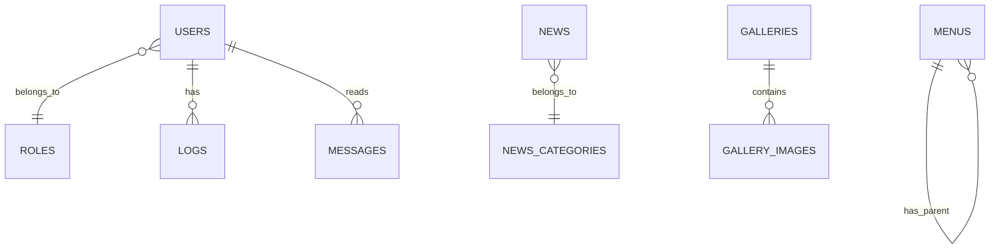

# Database Design Document

## Website Profil Sekolah Dasar (SD)

---

**Dokumen**: DATABASE - Database Design Document
**Proyek**: Website Profil Sekolah Dasar
**Versi**: 1.0
**Tanggal**: 2025-01-01
**DBMS**: MySQL 8.0+
**Engine**: InnoDB
**Charset**: utf8mb4
**Collation**: utf8mb4_unicode_ci

---

## Daftar Isi

1. [Entity Relationship Diagram (ERD)](#1-entity-relationship-diagram-erd)
2. [Struktur Tabel](#2-struktur-tabel)
3. [Normalisasi Database](#3-normalisasi-database)
4. [Rekomendasi Indexing](#4-rekomendasi-indexing)
5. [Relasi Antar Tabel](#5-relasi-antar-tabel)

---

## 1. Entity Relationship Diagram (ERD)

### 1.1 ERD Lengkap

```mermaid
erDiagram
    USERS ||--o{ LOGS : "membuat"
    USERS ||--o{ MESSAGES : "dibaca"
    ROLES ||--o{ USERS : "memiliki"
    
    MENUS ||--o{ MENUS : "parent-child"
    
    NEWS_CATEGORIES ||--o{ NEWS : "memiliki"
    
    GALLERIES ||--o{ GALLERY_IMAGES : "memiliki"
    
    SETTINGS ||--o{ SOCIAL_MEDIA : "memiliki"

    USERS {
        int id PK
        int role_id FK
        string name
        string email UK
        string password
        string photo
        enum status
        datetime last_login
        datetime created_at
        datetime updated_at
    }

    ROLES {
        int id PK
        string name UK
        string description
        datetime created_at
    }

    MENUS {
        int id PK
        string name
        string slug UK
        string url
        int parent_id FK
        string icon
        int sort_order
        enum position
        enum status
        datetime created_at
        datetime updated_at
    }

    SCHOOL_PROFILES {
        int id PK
        string school_name
        string npsn
        string address
        string village
        string district
        string city
        string province
        string postal_code
        string phone
        string email
        string website
        string logo
        string logo_white
        string favicon
        string vision
        text mission
        text history
        text principal_speech
        string principal_name
        string principal_photo
        string principal_qualification
        text organization_structure
        string google_maps_link
        text google_maps_embed
        datetime created_at
        datetime updated_at
    }

    TEACHERS {
        int id PK
        string name
        string nip UK
        string subject
        string position
        string education
        string photo
        string phone
        string email
        enum gender
        text bio
        enum status
        int sort_order
        datetime created_at
        datetime updated_at
    }

    STAFFS {
        int id PK
        string name
        string nip UK
        string position
        string department
        string photo
        string phone
        string email
        enum gender
        enum status
        int sort_order
        datetime created_at
        datetime updated_at
    }

    STUDENT_STATISTICS {
        int id PK
        int year
        int total_students
        int male_count
        int female_count
        int total_class
        text note
        datetime created_at
        datetime updated_at
    }

    ACHIEVEMENTS {
        int id PK
        string title
        string category
        string rank
        string level
        int year
        string photo
        text description
        enum status
        datetime created_at
        datetime updated_at
    }

    FACILITIES {
        int id PK
        string name
        string icon
        string photo
        text description
        int total
        enum status
        int sort_order
        datetime created_at
        datetime updated_at
    }

    PROGRAMS {
        int id PK
        string name
        string icon
        string photo
        text description
        enum type
        enum status
        int sort_order
        datetime created_at
        datetime updated_at
    }

    NEWS_CATEGORIES {
        int id PK
        string name
        string slug UK
        text description
        enum status
        int sort_order
        datetime created_at
        datetime updated_at
    }

    NEWS {
        int id PK
        string title
        string slug UK
        int category_id FK
        text content
        string thumbnail
        string author
        enum status
        int views
        date published_at
        string meta_title
        text meta_description
        text meta_keywords
        datetime created_at
        datetime updated_at
    }

    ANNOUNCEMENTS {
        int id PK
        string title
        string slug UK
        text content
        enum priority
        enum status
        date published_at
        date expired_at
        datetime created_at
        datetime updated_at
    }

    EVENTS {
        int id PK
        string title
        string slug UK
        text description
        string location
        date start_date
        date end_date
        time start_time
        time end_time
        string photo
        enum status
        datetime created_at
        datetime updated_at
    }

    GALLERIES {
        int id PK
        string title
        string slug UK
        text description
        string cover
        enum status
        datetime created_at
        datetime updated_at
    }

    GALLERY_IMAGES {
        int id PK
        int gallery_id FK
        string image
        string caption
        int sort_order
        datetime created_at
    }

    VIDEOS {
        int id PK
        string title
        string slug UK
        string url
        string embed_url
        string platform
        string thumbnail
        text description
        string category
        enum status
        int sort_order
        datetime created_at
        datetime updated_at
    }

    DOWNLOADS {
        int id PK
        string title
        string slug UK
        string file
        string file_type
        int file_size
        string category
        text description
        int download_count
        enum status
        datetime created_at
        datetime updated_at
    }

    FAQS {
        int id PK
        string question
        text answer
        string category
        int sort_order
        enum status
        datetime created_at
        datetime updated_at
    }

    TESTIMONIALS {
        int id PK
        string name
        string origin
        string photo
        text content
        int rating
        enum status
        int sort_order
        datetime created_at
        datetime updated_at
    }

    SLIDERS {
        int id PK
        string title
        text subtitle
        string button_text
        string button_url
        string image
        string image_mobile
        int sort_order
        enum status
        datetime created_at
        datetime updated_at
    }

    BANNERS {
        int id PK
        string title
        string image
        string url
        string position
        enum status
        int sort_order
        date start_date
        date end_date
        datetime created_at
        datetime updated_at
    }

    CONTACTS {
        int id PK
        string address
        string phone
        string phone_2
        string email
        string email_2
        string whatsapp
        string google_maps_link
        text google_maps_embed
        string working_hours
        datetime created_at
        datetime updated_at
    }

    MESSAGES {
        int id PK
        string name
        string email
        string phone
        string subject
        text message
        enum status
        int read_by FK
        datetime read_at
        datetime created_at
    }

    PPDB {
        int id PK
        string registration_number UK
        string student_name
        string place_of_birth
        date date_of_birth
        enum gender
        string religion
        string address
        string village
        string district
        string city
        string province
        string postal_code
        string previous_school
        string father_name
        string father_education
        string father_occupation
        string mother_name
        string mother_education
        string mother_occupation
        string parent_phone
        string parent_email
        string file_birth_certificate
        string file_family_card
        string file_photo
        string file_previous_report
        enum registration_phase
        enum status
        text notes
        datetime registered_at
        datetime created_at
        datetime updated_at
    }

    SOCIAL_MEDIA {
        int id PK
        string platform
        string icon
        string url
        enum status
        int sort_order
        datetime created_at
        datetime updated_at
    }

    SETTINGS {
        int id PK
        string key UK
        text value
        string group
        string type
        datetime created_at
        datetime updated_at
    }

    LOGS {
        int id PK
        int user_id FK
        string action
        string module
        int record_id
        text description
        string ip_address
        text user_agent
        datetime created_at
    }
```



### 1.2 ERD Relasi (Sederhana)



---

## 2. Struktur Tabel

### 2.1 Tabel: `users`

Menyimpan data user/admin yang memiliki akses ke panel administrasi.

| Field | Type | Constraint | Default | Deskripsi |
|-------|------|-----------|---------|-----------|
| id | INT(11) | PRIMARY KEY, AUTO_INCREMENT | | ID unik user |
| role_id | INT(11) | FOREIGN KEY → roles(id), NOT NULL | | ID role |
| name | VARCHAR(100) | NOT NULL | | Nama lengkap |
| email | VARCHAR(100) | NOT NULL, UNIQUE | | Email login |
| password | VARCHAR(255) | NOT NULL | | Password (bcrypt hash) |
| photo | VARCHAR(255) | NULL | | Foto profil |
| status | ENUM('active','inactive') | NOT NULL | 'active' | Status akun |
| last_login | DATETIME | NULL | | Waktu login terakhir |
| created_at | DATETIME | NOT NULL | CURRENT_TIMESTAMP | Waktu dibuat |
| updated_at | DATETIME | NOT NULL | CURRENT_TIMESTAMP ON UPDATE | Waktu diupdate |

**Index:**
- PRIMARY KEY (`id`)
- UNIQUE KEY (`email`)
- INDEX (`role_id`)

### 2.2 Tabel: `roles`

Menyimpan role/hak akses user.

| Field | Type | Constraint | Default | Deskripsi |
|-------|------|-----------|---------|-----------|
| id | INT(11) | PRIMARY KEY, AUTO_INCREMENT | | ID unik role |
| name | VARCHAR(50) | NOT NULL, UNIQUE | | Nama role (superadmin, admin, operator) |
| description | TEXT | NULL | | Deskripsi role |
| created_at | DATETIME | NOT NULL | CURRENT_TIMESTAMP | Waktu dibuat |

**Index:**
- PRIMARY KEY (`id`)
- UNIQUE KEY (`name`)

### 2.3 Tabel: `menus`

Menyimpan menu navigasi website.

| Field | Type | Constraint | Default | Deskripsi |
|-------|------|-----------|---------|-----------|
| id | INT(11) | PRIMARY KEY, AUTO_INCREMENT | | ID unik menu |
| name | VARCHAR(100) | NOT NULL | | Nama menu |
| slug | VARCHAR(100) | NOT NULL, UNIQUE | | Slug untuk routing |
| url | VARCHAR(255) | NULL | | URL/route tujuan |
| parent_id | INT(11) | FOREIGN KEY → menus(id), NULL | | ID parent menu (untuk submenu) |
| icon | VARCHAR(100) | NULL | | Nama icon |
| sort_order | INT(3) | NOT NULL | 0 | Urutan tampil |
| position | ENUM('header','footer','both') | NOT NULL | 'header' | Posisi menu |
| status | ENUM('active','inactive') | NOT NULL | 'active' | Status menu |
| created_at | DATETIME | NOT NULL | CURRENT_TIMESTAMP | Waktu dibuat |
| updated_at | DATETIME | NOT NULL | CURRENT_TIMESTAMP ON UPDATE | Waktu diupdate |

**Index:**
- PRIMARY KEY (`id`)
- UNIQUE KEY (`slug`)
- INDEX (`parent_id`)
- INDEX (`sort_order`)

### 2.4 Tabel: `school_profiles`

Menyimpan data profil sekolah. Hanya ada 1 record.

| Field | Type | Constraint | Default | Deskripsi |
|-------|------|-----------|---------|-----------|
| id | INT(11) | PRIMARY KEY, AUTO_INCREMENT | | ID unik |
| school_name | VARCHAR(200) | NOT NULL | | Nama sekolah |
| npsn | VARCHAR(20) | NULL | | NPSN sekolah |
| address | TEXT | NOT NULL | | Alamat sekolah |
| village | VARCHAR(100) | NULL | | Kelurahan/Desa |
| district | VARCHAR(100) | NULL | | Kecamatan |
| city | VARCHAR(100) | NULL | | Kota/Kabupaten |
| province | VARCHAR(100) | NULL | | Provinsi |
| postal_code | VARCHAR(10) | NULL | | Kode pos |
| phone | VARCHAR(20) | NULL | | Nomor telepon |
| email | VARCHAR(100) | NULL | | Email sekolah |
| website | VARCHAR(100) | NULL | | Website sekolah |
| logo | VARCHAR(255) | NULL | | Logo sekolah |
| logo_white | VARCHAR(255) | NULL | | Logo putih (footer) |
| favicon | VARCHAR(255) | NULL | | Favicon |
| vision | TEXT | NULL | | Visi sekolah |
| mission | TEXT | NULL | | Misi sekolah (dipisah newline) |
| history | TEXT | NULL | | Sejarah sekolah |
| principal_speech | TEXT | NULL | | Sambutan kepala sekolah |
| principal_name | VARCHAR(100) | NULL | | Nama kepala sekolah |
| principal_photo | VARCHAR(255) | NULL | | Foto kepala sekolah |
| principal_qualification | VARCHAR(100) | NULL | | Gelar kepala sekolah |
| organization_structure | TEXT | NULL | | Struktur organisasi (JSON) |
| google_maps_link | VARCHAR(500) | NULL | | Link Google Maps |
| google_maps_embed | TEXT | NULL | | Embed Google Maps |
| created_at | DATETIME | NOT NULL | CURRENT_TIMESTAMP | Waktu dibuat |
| updated_at | DATETIME | NOT NULL | CURRENT_TIMESTAMP ON UPDATE | Waktu diupdate |

**Index:**
- PRIMARY KEY (`id`)

### 2.5 Tabel: `teachers`

Menyimpan data guru.

| Field | Type | Constraint | Default | Deskripsi |
|-------|------|-----------|---------|-----------|
| id | INT(11) | PRIMARY KEY, AUTO_INCREMENT | | ID unik guru |
| name | VARCHAR(100) | NOT NULL | | Nama lengkap |
| nip | VARCHAR(30) | UNIQUE, NULL | | NIP (jika PNS) |
| subject | VARCHAR(100) | NULL | | Mata pelajaran |
| position | VARCHAR(100) | NULL | | Jabatan (Kepsek, Wali Kelas, dll) |
| education | VARCHAR(100) | NULL | | Pendidikan terakhir |
| photo | VARCHAR(255) | NULL | | Foto guru |
| phone | VARCHAR(20) | NULL | | Nomor telepon |
| email | VARCHAR(100) | NULL | | Email |
| gender | ENUM('L','P') | NULL | | Jenis kelamin |
| bio | TEXT | NULL | | Biografi singkat |
| status | ENUM('active','inactive') | NOT NULL | 'active' | Status |
| sort_order | INT(3) | NOT NULL | 0 | Urutan tampil |
| created_at | DATETIME | NOT NULL | CURRENT_TIMESTAMP | Waktu dibuat |
| updated_at | DATETIME | NOT NULL | CURRENT_TIMESTAMP ON UPDATE | Waktu diupdate |

**Index:**
- PRIMARY KEY (`id`)
- UNIQUE KEY (`nip`)
- INDEX (`status`)
- INDEX (`sort_order`)

### 2.6 Tabel: `staffs`

Menyimpan data staff tata usaha.

| Field | Type | Constraint | Default | Deskripsi |
|-------|------|-----------|---------|-----------|
| id | INT(11) | PRIMARY KEY, AUTO_INCREMENT | | ID unik staff |
| name | VARCHAR(100) | NOT NULL | | Nama lengkap |
| nip | VARCHAR(30) | UNIQUE, NULL | | NIP |
| position | VARCHAR(100) | NULL | | Jabatan |
| department | VARCHAR(100) | NULL | | Bagian |
| photo | VARCHAR(255) | NULL | | Foto staff |
| phone | VARCHAR(20) | NULL | | Nomor telepon |
| email | VARCHAR(100) | NULL | | Email |
| gender | ENUM('L','P') | NULL | | Jenis kelamin |
| status | ENUM('active','inactive') | NOT NULL | 'active' | Status |
| sort_order | INT(3) | NOT NULL | 0 | Urutan tampil |
| created_at | DATETIME | NOT NULL | CURRENT_TIMESTAMP | Waktu dibuat |
| updated_at | DATETIME | NOT NULL | CURRENT_TIMESTAMP ON UPDATE | Waktu diupdate |

**Index:**
- PRIMARY KEY (`id`)
- UNIQUE KEY (`nip`)
- INDEX (`status`)
- INDEX (`sort_order`)

### 2.7 Tabel: `student_statistics`

Menyimpan data statistik siswa per tahun.

| Field | Type | Constraint | Default | Deskripsi |
|-------|------|-----------|---------|-----------|
| id | INT(11) | PRIMARY KEY, AUTO_INCREMENT | | ID unik |
| year | YEAR(4) | NOT NULL | | Tahun ajaran |
| total_students | INT(6) | NOT NULL | 0 | Total siswa |
| male_count | INT(6) | NOT NULL | 0 | Jumlah siswa laki-laki |
| female_count | INT(6) | NOT NULL | 0 | Jumlah siswa perempuan |
| total_class | INT(3) | NOT NULL | 0 | Jumlah rombel |
| note | TEXT | NULL | | Catatan |
| created_at | DATETIME | NOT NULL | CURRENT_TIMESTAMP | Waktu dibuat |
| updated_at | DATETIME | NOT NULL | CURRENT_TIMESTAMP ON UPDATE | Waktu diupdate |

**Index:**
- PRIMARY KEY (`id`)
- INDEX (`year`)
- UNIQUE KEY (`year`)

### 2.8 Tabel: `achievements`

Menyimpan data prestasi sekolah.

| Field | Type | Constraint | Default | Deskripsi |
|-------|------|-----------|---------|-----------|
| id | INT(11) | PRIMARY KEY, AUTO_INCREMENT | | ID unik prestasi |
| title | VARCHAR(200) | NOT NULL | | Judul prestasi |
| category | ENUM('akademik','non-akademik') | NOT NULL | | Kategori |
| rank | VARCHAR(50) | NULL | | Juara (1, 2, 3) |
| level | ENUM('sekolah','kecamatan','kota','provinsi','nasional','internasional') | NOT NULL | | Tingkat |
| year | YEAR(4) | NOT NULL | | Tahun |
| photo | VARCHAR(255) | NULL | | Foto/sertifikat |
| description | TEXT | NULL | | Deskripsi |
| status | ENUM('active','inactive') | NOT NULL | 'active' | Status |
| created_at | DATETIME | NOT NULL | CURRENT_TIMESTAMP | Waktu dibuat |
| updated_at | DATETIME | NOT NULL | CURRENT_TIMESTAMP ON UPDATE | Waktu diupdate |

**Index:**
- PRIMARY KEY (`id`)
- INDEX (`category`)
- INDEX (`level`)
- INDEX (`year`)
- INDEX (`status`)

### 2.9 Tabel: `facilities`

Menyimpan data fasilitas sekolah.

| Field | Type | Constraint | Default | Deskripsi |
|-------|------|-----------|---------|-----------|
| id | INT(11) | PRIMARY KEY, AUTO_INCREMENT | | ID unik fasilitas |
| name | VARCHAR(100) | NOT NULL | | Nama fasilitas |
| icon | VARCHAR(100) | NULL | | Icon/emoji |
| photo | VARCHAR(255) | NULL | | Foto fasilitas |
| description | TEXT | NULL | | Deskripsi |
| total | INT(3) | NOT NULL | 1 | Jumlah |
| status | ENUM('active','inactive') | NOT NULL | 'active' | Status |
| sort_order | INT(3) | NOT NULL | 0 | Urutan tampil |
| created_at | DATETIME | NOT NULL | CURRENT_TIMESTAMP | Waktu dibuat |
| updated_at | DATETIME | NOT NULL | CURRENT_TIMESTAMP ON UPDATE | Waktu diupdate |

**Index:**
- PRIMARY KEY (`id`)
- INDEX (`status`)
- INDEX (`sort_order`)

### 2.10 Tabel: `programs`

Menyimpan data program sekolah.

| Field | Type | Constraint | Default | Deskripsi |
|-------|------|-----------|---------|-----------|
| id | INT(11) | PRIMARY KEY, AUTO_INCREMENT | | ID unik program |
| name | VARCHAR(100) | NOT NULL | | Nama program |
| icon | VARCHAR(100) | NULL | | Icon |
| photo | VARCHAR(255) | NULL | | Foto |
| description | TEXT | NULL | | Deskripsi program |
| type | ENUM('akademik','ekstrakurikuler','keagamaan','keterampilan') | NOT NULL | | Tipe program |
| status | ENUM('active','inactive') | NOT NULL | 'active' | Status |
| sort_order | INT(3) | NOT NULL | 0 | Urutan tampil |
| created_at | DATETIME | NOT NULL | CURRENT_TIMESTAMP | Waktu dibuat |
| updated_at | DATETIME | NOT NULL | CURRENT_TIMESTAMP ON UPDATE | Waktu diupdate |

**Index:**
- PRIMARY KEY (`id`)
- INDEX (`type`)
- INDEX (`status`)
- INDEX (`sort_order`)

### 2.11 Tabel: `news_categories`

Menyimpan kategori berita.

| Field | Type | Constraint | Default | Deskripsi |
|-------|------|-----------|---------|-----------|
| id | INT(11) | PRIMARY KEY, AUTO_INCREMENT | | ID unik kategori |
| name | VARCHAR(100) | NOT NULL | | Nama kategori |
| slug | VARCHAR(100) | NOT NULL, UNIQUE | | Slug kategori |
| description | TEXT | NULL | | Deskripsi |
| status | ENUM('active','inactive') | NOT NULL | 'active' | Status |
| sort_order | INT(3) | NOT NULL | 0 | Urutan |
| created_at | DATETIME | NOT NULL | CURRENT_TIMESTAMP | Waktu dibuat |
| updated_at | DATETIME | NOT NULL | CURRENT_TIMESTAMP ON UPDATE | Waktu diupdate |

**Index:**
- PRIMARY KEY (`id`)
- UNIQUE KEY (`slug`)
- INDEX (`status`)

### 2.12 Tabel: `news`

Menyimpan berita/artikel.

| Field | Type | Constraint | Default | Deskripsi |
|-------|------|-----------|---------|-----------|
| id | INT(11) | PRIMARY KEY, AUTO_INCREMENT | | ID unik berita |
| title | VARCHAR(200) | NOT NULL | | Judul berita |
| slug | VARCHAR(200) | NOT NULL, UNIQUE | | Slug berita |
| category_id | INT(11) | FOREIGN KEY → news_categories(id), NULL | | Kategori |
| content | LONGTEXT | NOT NULL | | Konten berita |
| thumbnail | VARCHAR(255) | NULL | | Thumbnail |
| author | VARCHAR(100) | NOT NULL | | Penulis |
| status | ENUM('draft','published','archived') | NOT NULL | 'draft' | Status |
| views | INT(10) | NOT NULL | 0 | Jumlah dilihat |
| published_at | DATETIME | NULL | | Waktu publish |
| meta_title | VARCHAR(200) | NULL | | SEO title |
| meta_description | TEXT | NULL | | SEO description |
| meta_keywords | TEXT | NULL | | SEO keywords |
| created_at | DATETIME | NOT NULL | CURRENT_TIMESTAMP | Waktu dibuat |
| updated_at | DATETIME | NOT NULL | CURRENT_TIMESTAMP ON UPDATE | Waktu diupdate |

**Index:**
- PRIMARY KEY (`id`)
- UNIQUE KEY (`slug`)
- INDEX (`category_id`)
- INDEX (`status`)
- INDEX (`published_at`)
- FULLTEXT (`title`, `content`)

### 2.13 Tabel: `announcements`

Menyimpan pengumuman.

| Field | Type | Constraint | Default | Deskripsi |
|-------|------|-----------|---------|-----------|
| id | INT(11) | PRIMARY KEY, AUTO_INCREMENT | | ID unik pengumuman |
| title | VARCHAR(200) | NOT NULL | | Judul pengumuman |
| slug | VARCHAR(200) | NOT NULL, UNIQUE | | Slug |
| content | TEXT | NOT NULL | | Konten pengumuman |
| priority | ENUM('normal','important','urgent') | NOT NULL | 'normal' | Prioritas |
| status | ENUM('draft','published') | NOT NULL | 'draft' | Status |
| published_at | DATETIME | NULL | | Tanggal publish |
| expired_at | DATETIME | NULL | | Tanggal kadaluarsa |
| created_at | DATETIME | NOT NULL | CURRENT_TIMESTAMP | Waktu dibuat |
| updated_at | DATETIME | NOT NULL | CURRENT_TIMESTAMP ON UPDATE | Waktu diupdate |

**Index:**
- PRIMARY KEY (`id`)
- UNIQUE KEY (`slug`)
- INDEX (`priority`)
- INDEX (`status`)
- INDEX (`published_at`)

### 2.14 Tabel: `events`

Menyimpan agenda/kegiatan sekolah.

| Field | Type | Constraint | Default | Deskripsi |
|-------|------|-----------|---------|-----------|
| id | INT(11) | PRIMARY KEY, AUTO_INCREMENT | | ID unik agenda |
| title | VARCHAR(200) | NOT NULL | | Nama agenda |
| slug | VARCHAR(200) | NOT NULL, UNIQUE | | Slug |
| description | TEXT | NULL | | Deskripsi |
| location | VARCHAR(200) | NULL | | Tempat |
| start_date | DATE | NOT NULL | | Tanggal mulai |
| end_date | DATE | NULL | | Tanggal selesai |
| start_time | TIME | NULL | | Jam mulai |
| end_time | TIME | NULL | | Jam selesai |
| photo | VARCHAR(255) | NULL | | Foto |
| status | ENUM('upcoming','ongoing','completed','cancelled') | NOT NULL | 'upcoming' | Status |
| created_at | DATETIME | NOT NULL | CURRENT_TIMESTAMP | Waktu dibuat |
| updated_at | DATETIME | NOT NULL | CURRENT_TIMESTAMP ON UPDATE | Waktu diupdate |

**Index:**
- PRIMARY KEY (`id`)
- UNIQUE KEY (`slug`)
- INDEX (`start_date`)
- INDEX (`status`)

### 2.15 Tabel: `galleries`

Menyimpan album galeri foto.

| Field | Type | Constraint | Default | Deskripsi |
|-------|------|-----------|---------|-----------|
| id | INT(11) | PRIMARY KEY, AUTO_INCREMENT | | ID unik album |
| title | VARCHAR(200) | NOT NULL | | Judul album |
| slug | VARCHAR(200) | NOT NULL, UNIQUE | | Slug |
| description | TEXT | NULL | | Deskripsi album |
| cover | VARCHAR(255) | NULL | | Cover/foto sampul |
| status | ENUM('active','inactive') | NOT NULL | 'active' | Status |
| created_at | DATETIME | NOT NULL | CURRENT_TIMESTAMP | Waktu dibuat |
| updated_at | DATETIME | NOT NULL | CURRENT_TIMESTAMP ON UPDATE | Waktu diupdate |

**Index:**
- PRIMARY KEY (`id`)
- UNIQUE KEY (`slug`)
- INDEX (`status`)

### 2.16 Tabel: `gallery_images`

Menyimpan foto-foto dalam album.

| Field | Type | Constraint | Default | Deskripsi |
|-------|------|-----------|---------|-----------|
| id | INT(11) | PRIMARY KEY, AUTO_INCREMENT | | ID unik foto |
| gallery_id | INT(11) | FOREIGN KEY → galleries(id) ON DELETE CASCADE | | ID album |
| image | VARCHAR(255) | NOT NULL | | File foto |
| caption | VARCHAR(200) | NULL | | Keterangan foto |
| sort_order | INT(3) | NOT NULL | 0 | Urutan |
| created_at | DATETIME | NOT NULL | CURRENT_TIMESTAMP | Waktu dibuat |

**Index:**
- PRIMARY KEY (`id`)
- INDEX (`gallery_id`)
- INDEX (`sort_order`)

### 2.17 Tabel: `videos`

Menyimpan data video (embed YouTube).

| Field | Type | Constraint | Default | Deskripsi |
|-------|------|-----------|---------|-----------|
| id | INT(11) | PRIMARY KEY, AUTO_INCREMENT | | ID unik video |
| title | VARCHAR(200) | NOT NULL | | Judul video |
| slug | VARCHAR(200) | NOT NULL, UNIQUE | | Slug |
| url | VARCHAR(500) | NOT NULL | | URL video |
| embed_url | VARCHAR(500) | NULL | | URL embed |
| platform | ENUM('youtube','vimeo','other') | NOT NULL | 'youtube' | Platform |
| thumbnail | VARCHAR(255) | NULL | | Thumbnail custom |
| description | TEXT | NULL | | Deskripsi |
| category | VARCHAR(100) | NULL | | Kategori |
| status | ENUM('active','inactive') | NOT NULL | 'active' | Status |
| sort_order | INT(3) | NOT NULL | 0 | Urutan |
| created_at | DATETIME | NOT NULL | CURRENT_TIMESTAMP | Waktu dibuat |
| updated_at | DATETIME | NOT NULL | CURRENT_TIMESTAMP ON UPDATE | Waktu diupdate |

**Index:**
- PRIMARY KEY (`id`)
- UNIQUE KEY (`slug`)
- INDEX (`status`)
- INDEX (`category`)
- INDEX (`sort_order`)

### 2.18 Tabel: `downloads`

Menyimpan data dokumen yang dapat diunduh.

| Field | Type | Constraint | Default | Deskripsi |
|-------|------|-----------|---------|-----------|
| id | INT(11) | PRIMARY KEY, AUTO_INCREMENT | | ID unik download |
| title | VARCHAR(200) | NOT NULL | | Judul dokumen |
| slug | VARCHAR(200) | NOT NULL, UNIQUE | | Slug |
| file | VARCHAR(255) | NOT NULL | | File |
| file_type | VARCHAR(50) | NULL | | Tipe file (PDF, DOC, XLS) |
| file_size | INT(10) | NULL | 0 | Ukuran file (bytes) |
| category | VARCHAR(100) | NULL | | Kategori dokumen |
| description | TEXT | NULL | | Deskripsi |
| download_count | INT(10) | NOT NULL | 0 | Jumlah diunduh |
| status | ENUM('active','inactive') | NOT NULL | 'active' | Status |
| created_at | DATETIME | NOT NULL | CURRENT_TIMESTAMP | Waktu dibuat |
| updated_at | DATETIME | NOT NULL | CURRENT_TIMESTAMP ON UPDATE | Waktu diupdate |

**Index:**
- PRIMARY KEY (`id`)
- UNIQUE KEY (`slug`)
- INDEX (`status`)
- INDEX (`category`)

### 2.19 Tabel: `faqs`

Menyimpan data FAQ.

| Field | Type | Constraint | Default | Deskripsi |
|-------|------|-----------|---------|-----------|
| id | INT(11) | PRIMARY KEY, AUTO_INCREMENT | | ID unik FAQ |
| question | TEXT | NOT NULL | | Pertanyaan |
| answer | TEXT | NOT NULL | | Jawaban |
| category | VARCHAR(100) | NULL | | Kategori FAQ |
| sort_order | INT(3) | NOT NULL | 0 | Urutan |
| status | ENUM('active','inactive') | NOT NULL | 'active' | Status |
| created_at | DATETIME | NOT NULL | CURRENT_TIMESTAMP | Waktu dibuat |
| updated_at | DATETIME | NOT NULL | CURRENT_TIMESTAMP ON UPDATE | Waktu diupdate |

**Index:**
- PRIMARY KEY (`id`)
- INDEX (`status`)
- INDEX (`category`)
- INDEX (`sort_order`)

### 2.20 Tabel: `testimonials`

Menyimpan data testimoni.

| Field | Type | Constraint | Default | Deskripsi |
|-------|------|-----------|---------|-----------|
| id | INT(11) | PRIMARY KEY, AUTO_INCREMENT | | ID unik testimoni |
| name | VARCHAR(100) | NOT NULL | | Nama pemberi testimoni |
| origin | VARCHAR(100) | NULL | | Asal (orang tua, alumni) |
| photo | VARCHAR(255) | NULL | | Foto |
| content | TEXT | NOT NULL | | Isi testimoni |
| rating | TINYINT(1) | NOT NULL | 5 | Rating (1-5) |
| status | ENUM('active','inactive') | NOT NULL | 'active' | Status |
| sort_order | INT(3) | NOT NULL | 0 | Urutan |
| created_at | DATETIME | NOT NULL | CURRENT_TIMESTAMP | Waktu dibuat |
| updated_at | DATETIME | NOT NULL | CURRENT_TIMESTAMP ON UPDATE | Waktu diupdate |

**Index:**
- PRIMARY KEY (`id`)
- INDEX (`status`)
- INDEX (`sort_order`)

### 2.21 Tabel: `sliders`

Menyimpan data slider hero.

| Field | Type | Constraint | Default | Deskripsi |
|-------|------|-----------|---------|-----------|
| id | INT(11) | PRIMARY KEY, AUTO_INCREMENT | | ID unik slider |
| title | VARCHAR(200) | NULL | | Judul slider |
| subtitle | TEXT | NULL | | Subtitle |
| button_text | VARCHAR(100) | NULL | | Teks tombol |
| button_url | VARCHAR(255) | NULL | | URL tombol |
| image | VARCHAR(255) | NOT NULL | | Gambar slider (desktop) |
| image_mobile | VARCHAR(255) | NULL | | Gambar slider (mobile) |
| sort_order | INT(3) | NOT NULL | 0 | Urutan |
| status | ENUM('active','inactive') | NOT NULL | 'active' | Status |
| created_at | DATETIME | NOT NULL | CURRENT_TIMESTAMP | Waktu dibuat |
| updated_at | DATETIME | NOT NULL | CURRENT_TIMESTAMP ON UPDATE | Waktu diupdate |

**Index:**
- PRIMARY KEY (`id`)
- INDEX (`status`)
- INDEX (`sort_order`)

### 2.22 Tabel: `banners`

Menyimpan data banner iklan/promosi.

| Field | Type | Constraint | Default | Deskripsi |
|-------|------|-----------|---------|-----------|
| id | INT(11) | PRIMARY KEY, AUTO_INCREMENT | | ID unik banner |
| title | VARCHAR(200) | NULL | | Judul banner |
| image | VARCHAR(255) | NOT NULL | | Gambar banner |
| url | VARCHAR(255) | NULL | | URL tujuan |
| position | ENUM('top','bottom','sidebar','content') | NOT NULL | 'sidebar' | Posisi banner |
| status | ENUM('active','inactive') | NOT NULL | 'active' | Status |
| sort_order | INT(3) | NOT NULL | 0 | Urutan |
| start_date | DATE | NULL | | Tanggal mulai tayang |
| end_date | DATE | NULL | | Tanggal selesai tayang |
| created_at | DATETIME | NOT NULL | CURRENT_TIMESTAMP | Waktu dibuat |
| updated_at | DATETIME | NOT NULL | CURRENT_TIMESTAMP ON UPDATE | Waktu diupdate |

**Index:**
- PRIMARY KEY (`id`)
- INDEX (`position`)
- INDEX (`status`)
- INDEX (`start_date`, `end_date`)

### 2.23 Tabel: `contacts`

Menyimpan data kontak sekolah. Hanya 1 record.

| Field | Type | Constraint | Default | Deskripsi |
|-------|------|-----------|---------|-----------|
| id | INT(11) | PRIMARY KEY, AUTO_INCREMENT | | ID unik |
| address | TEXT | NULL | | Alamat lengkap |
| phone | VARCHAR(20) | NULL | | Nomor telepon 1 |
| phone_2 | VARCHAR(20) | NULL | | Nomor telepon 2 |
| email | VARCHAR(100) | NULL | | Email 1 |
| email_2 | VARCHAR(100) | NULL | | Email 2 |
| whatsapp | VARCHAR(20) | NULL | | Nomor WhatsApp |
| google_maps_link | VARCHAR(500) | NULL | | Link Google Maps |
| google_maps_embed | TEXT | NULL | | Embed Google Maps |
| working_hours | VARCHAR(200) | NULL | | Jam kerja |
| created_at | DATETIME | NOT NULL | CURRENT_TIMESTAMP | Waktu dibuat |
| updated_at | DATETIME | NOT NULL | CURRENT_TIMESTAMP ON UPDATE | Waktu diupdate |

**Index:**
- PRIMARY KEY (`id`)

### 2.24 Tabel: `messages`

Menyimpan pesan dari form kontak.

| Field | Type | Constraint | Default | Deskripsi |
|-------|------|-----------|---------|-----------|
| id | INT(11) | PRIMARY KEY, AUTO_INCREMENT | | ID unik pesan |
| name | VARCHAR(100) | NOT NULL | | Nama pengirim |
| email | VARCHAR(100) | NOT NULL | | Email pengirim |
| phone | VARCHAR(20) | NULL | | Telepon |
| subject | VARCHAR(200) | NULL | | Subjek |
| message | TEXT | NOT NULL | | Isi pesan |
| status | ENUM('unread','read','replied') | NOT NULL | 'unread' | Status |
| read_by | INT(11) | FOREIGN KEY → users(id), NULL | | Dibaca oleh |
| read_at | DATETIME | NULL | | Waktu dibaca |
| created_at | DATETIME | NOT NULL | CURRENT_TIMESTAMP | Waktu dikirim |

**Index:**
- PRIMARY KEY (`id`)
- INDEX (`status`)
- INDEX (`read_by`)
- INDEX (`created_at`)

### 2.25 Tabel: `ppdb`

Menyimpan data pendaftaran PPDB.

| Field | Type | Constraint | Default | Deskripsi |
|-------|------|-----------|---------|-----------|
| id | INT(11) | PRIMARY KEY, AUTO_INCREMENT | | ID unik |
| registration_number | VARCHAR(20) | NOT NULL, UNIQUE | | Nomor pendaftaran |
| student_name | VARCHAR(100) | NOT NULL | | Nama calon siswa |
| place_of_birth | VARCHAR(100) | NULL | | Tempat lahir |
| date_of_birth | DATE | NULL | | Tanggal lahir |
| gender | ENUM('L','P') | NOT NULL | | Jenis kelamin |
| religion | VARCHAR(50) | NULL | | Agama |
| address | TEXT | NULL | | Alamat calon siswa |
| village | VARCHAR(100) | NULL | | Desa/Kelurahan |
| district | VARCHAR(100) | NULL | | Kecamatan |
| city | VARCHAR(100) | NULL | | Kota |
| province | VARCHAR(100) | NULL | | Provinsi |
| postal_code | VARCHAR(10) | NULL | | Kode pos |
| previous_school | VARCHAR(100) | NULL | | Asal TK/PAUD |
| father_name | VARCHAR(100) | NULL | | Nama ayah |
| father_education | VARCHAR(50) | NULL | | Pendidikan ayah |
| father_occupation | VARCHAR(100) | NULL | | Pekerjaan ayah |
| mother_name | VARCHAR(100) | NULL | | Nama ibu |
| mother_education | VARCHAR(50) | NULL | | Pendidikan ibu |
| mother_occupation | VARCHAR(100) | NULL | | Pekerjaan ibu |
| parent_phone | VARCHAR(20) | NOT NULL | | No HP orang tua |
| parent_email | VARCHAR(100) | NULL | | Email orang tua |
| file_birth_certificate | VARCHAR(255) | NULL | | File akta lahir |
| file_family_card | VARCHAR(255) | NULL | | File KK |
| file_photo | VARCHAR(255) | NULL | | Foto calon siswa |
| file_previous_report | VARCHAR(255) | NULL | | Raport sebelumnya |
| registration_phase | VARCHAR(50) | NULL | | Gelombang pendaftaran |
| status | ENUM('pending','verified','approved','rejected','waiting_list') | NOT NULL | 'pending' | Status pendaftar |
| notes | TEXT | NULL | | Catatan admin |
| registered_at | DATETIME | NOT NULL | CURRENT_TIMESTAMP | Tanggal daftar |
| created_at | DATETIME | NOT NULL | CURRENT_TIMESTAMP | Waktu dibuat |
| updated_at | DATETIME | NOT NULL | CURRENT_TIMESTAMP ON UPDATE | Waktu diupdate |

**Index:**
- PRIMARY KEY (`id`)
- UNIQUE KEY (`registration_number`)
- INDEX (`status`)
- INDEX (`registered_at`)
- INDEX (`student_name`)

### 2.26 Tabel: `social_media`

Menyimpan data sosial media sekolah.

| Field | Type | Constraint | Default | Deskripsi |
|-------|------|-----------|---------|-----------|
| id | INT(11) | PRIMARY KEY, AUTO_INCREMENT | | ID unik |
| platform | VARCHAR(50) | NOT NULL | | Nama platform (Facebook, IG, YouTube) |
| icon | VARCHAR(100) | NULL | | Icon |
| url | VARCHAR(500) | NOT NULL | | URL profile |
| status | ENUM('active','inactive') | NOT NULL | 'active' | Status |
| sort_order | INT(3) | NOT NULL | 0 | Urutan |
| created_at | DATETIME | NOT NULL | CURRENT_TIMESTAMP | Waktu dibuat |
| updated_at | DATETIME | NOT NULL | CURRENT_TIMESTAMP ON UPDATE | Waktu diupdate |

**Index:**
- PRIMARY KEY (`id`)
- INDEX (`status`)
- INDEX (`sort_order`)

### 2.27 Tabel: `settings`

Menyimpan pengaturan website (key-value).

| Field | Type | Constraint | Default | Deskripsi |
|-------|------|-----------|---------|-----------|
| id | INT(11) | PRIMARY KEY, AUTO_INCREMENT | | ID unik |
| key | VARCHAR(100) | NOT NULL, UNIQUE | | Key setting |
| value | LONGTEXT | NULL | | Value setting |
| group | VARCHAR(50) | NULL | 'general' | Grup setting |
| type | VARCHAR(50) | NULL | 'text' | Tipe (text, image, boolean) |
| created_at | DATETIME | NOT NULL | CURRENT_TIMESTAMP | Waktu dibuat |
| updated_at | DATETIME | NOT NULL | CURRENT_TIMESTAMP ON UPDATE | Waktu diupdate |

**Index:**
- PRIMARY KEY (`id`)
- UNIQUE KEY (`key`)
- INDEX (`group`)

### 2.28 Tabel: `logs`

Menyimpan log aktivitas.

| Field | Type | Constraint | Default | Deskripsi |
|-------|------|-----------|---------|-----------|
| id | BIGINT(20) | PRIMARY KEY, AUTO_INCREMENT | | ID unik log |
| user_id | INT(11) | FOREIGN KEY → users(id), NULL | | ID user |
| action | VARCHAR(50) | NOT NULL | | Aksi (create, update, delete, login) |
| module | VARCHAR(50) | NOT NULL | | Modul (news, teachers, dll) |
| record_id | INT(11) | NULL | | ID record yang diubah |
| description | TEXT | NULL | | Deskripsi log |
| ip_address | VARCHAR(45) | NULL | | IP address |
| user_agent | TEXT | NULL | | User agent browser |
| created_at | DATETIME | NOT NULL | CURRENT_TIMESTAMP | Waktu kejadian |

**Index:**
- PRIMARY KEY (`id`)
- INDEX (`user_id`)
- INDEX (`action`)
- INDEX (`module`)
- INDEX (`created_at`)

---

## 3. Normalisasi Database

### 3.1 Bentuk Normal 1 (1NF)

Semua tabel telah memenuhi 1NF karena:
- Setiap kolom berisi nilai atomik (tidak ada array atau objek di dalam kolom)
- Setiap record memiliki primary key unik
- Tidak ada kolom yang berulang

### 3.2 Bentuk Normal 2 (2NF)

Semua tabel telah memenuhi 2NF karena:
- Telah memenuhi 1NF
- Setiap kolom non-key bergantung secara fungsional pada seluruh primary key (bukan hanya sebagian)
- Tabel dengan composite key tidak ada

### 3.3 Bentuk Normal 3 (3NF)

Semua tabel telah memenuhi 3NF karena:
- Telah memenuhi 2NF
- Tidak ada ketergantungan transitif (kolom non-key tidak bergantung pada kolom non-key lainnya)

### 3.4 Analisis Normalisasi

| Tabel | 1NF | 2NF | 3NF | Keterangan |
|-------|-----|-----|-----|------------|
| users | ✓ | ✓ | ✓ | Sudah normal |
| roles | ✓ | ✓ | ✓ | Sudah normal |
| menus | ✓ | ✓ | ✓ | Sudah normal (self-referencing parent_id) |
| school_profiles | ✓ | ✓ | ✓ | Single row table |
| teachers | ✓ | ✓ | ✓ | Sudah normal |
| staffs | ✓ | ✓ | ✓ | Sudah normal |
| student_statistics | ✓ | ✓ | ✓ | Sudah normal |
| achievements | ✓ | ✓ | ✓ | Sudah normal |
| facilities | ✓ | ✓ | ✓ | Sudah normal |
| programs | ✓ | ✓ | ✓ | Sudah normal |
| news_categories | ✓ | ✓ | ✓ | Sudah normal |
| news | ✓ | ✓ | ✓ | Bergantung pada category_id |
| announcements | ✓ | ✓ | ✓ | Sudah normal |
| events | ✓ | ✓ | ✓ | Sudah normal |
| galleries | ✓ | ✓ | ✓ | Sudah normal |
| gallery_images | ✓ | ✓ | ✓ | Bergantung pada gallery_id (CASCADE) |
| videos | ✓ | ✓ | ✓ | Sudah normal |
| downloads | ✓ | ✓ | ✓ | Sudah normal |
| faqs | ✓ | ✓ | ✓ | Sudah normal |
| testimonials | ✓ | ✓ | ✓ | Sudah normal |
| sliders | ✓ | ✓ | ✓ | Sudah normal |
| banners | ✓ | ✓ | ✓ | Sudah normal |
| contacts | ✓ | ✓ | ✓ | Single row table |
| messages | ✓ | ✓ | ✓ | Sudah normal |
| ppdb | ✓ | ✓ | ✓ | Sudah normal |
| social_media | ✓ | ✓ | ✓ | Sudah normal |
| settings | ✓ | ✓ | ✓ | Key-value store |
| logs | ✓ | ✓ | ✓ | Sudah normal |

---

## 4. Rekomendasi Indexing

### 4.1 Index untuk Performance

| Tabel | Index | Kolom | Tipe | Alasan |
|-------|-------|-------|------|--------|
| news | idx_news_published | published_at, status | Composite | Filter berita published |
| news | idx_news_category | category_id | Simple | Join dengan categories |
| news | idx_news_search | title, content | FULLTEXT | Pencarian berita |
| news | idx_news_slug | slug | UNIQUE | Lookup by slug |
| teachers | idx_teachers_status | status | Simple | Filter guru aktif |
| achievements | idx_achievements_year | year, category | Composite | Filter prestasi |
| events | idx_events_date | start_date, status | Composite | Agenda mendatang |
| galleries | idx_galleries_status | status | Simple | Filter galeri aktif |
| gallery_images | idx_gallery_images_gallery | gallery_id | Simple | Join dengan galleries |
| ppdb | idx_ppdb_status | status | Simple | Filter status pendaftar |
| ppdb | idx_ppdb_registered | registered_at | Simple | Urutkan berdasarkan tanggal |
| messages | idx_messages_status | status | Simple | Filter pesan belum dibaca |
| logs | idx_logs_module | module, action | Composite | Filter log by modul |
| logs | idx_logs_created | created_at | Simple | Urutkan log by waktu |

### 4.2 Strategi Index

1. **Primary Key**: Semua tabel menggunakan AUTO_INCREMENT INT sebagai primary key.
2. **Foreign Key**: Seluruh foreign key di-index untuk mempercepat JOIN.
3. **Unique Key**: Kolom yang memerlukan nilai unik (email, slug, nip) menggunakan UNIQUE index.
4. **Composite Index**: Untuk query yang sering menggunakan multiple kolom dalam WHERE.
5. **Fulltext Index**: Untuk tabel `news` yang memerlukan pencarian teks.
6. **Index Status**: Kolom `status` di-index karena sering digunakan untuk filtering.

### 4.3 Query Example dengan Index

```sql
-- Query berita yang dipublikasikan (menggunakan composite index)
SELECT * FROM news 
WHERE status = 'published' AND published_at <= NOW()
ORDER BY published_at DESC
LIMIT 10;

-- Query pencarian berita (menggunakan FULLTEXT index)
SELECT * FROM news 
WHERE MATCH(title, content) AGAINST('sekolah adiwiyata' IN BOOLEAN MODE)
AND status = 'published';

-- Query agenda mendatang (menggunakan composite index)
SELECT * FROM events 
WHERE start_date >= CURDATE() AND status = 'upcoming'
ORDER BY start_date ASC;
```

---

## 5. Relasi Antar Tabel

### 5.1 Daftar Relasi

| Tabel 1 | Tabel 2 | Tipe Relasi | Foreign Key |
|---------|---------|-------------|-------------|
| users | roles | Many-to-One | users.role_id → roles.id |
| users | logs | One-to-Many | logs.user_id → users.id |
| users | messages | One-to-Many | messages.read_by → users.id |
| menus | menus | Self-Referencing | menus.parent_id → menus.id |
| news | news_categories | Many-to-One | news.category_id → news_categories.id |
| galleries | gallery_images | One-to-Many | gallery_images.gallery_id → galleries.id |

### 5.2 Aturan Relasi

| Foreign Key | ON DELETE | ON UPDATE |
|-------------|-----------|-----------|
| users.role_id → roles.id | RESTRICT | CASCADE |
| logs.user_id → users.id | SET NULL | CASCADE |
| messages.read_by → users.id | SET NULL | CASCADE |
| menus.parent_id → menus.id | SET NULL | CASCADE |
| news.category_id → news_categories.id | SET NULL | CASCADE |
| gallery_images.gallery_id → galleries.id | CASCADE | CASCADE |

### 5.3 Konstanta ENUM

| Tabel | Kolom | Nilai |
|-------|-------|-------|
| users | status | 'active', 'inactive' |
| news | status | 'draft', 'published', 'archived' |
| announcements | priority | 'normal', 'important', 'urgent' |
| announcements | status | 'draft', 'published' |
| events | status | 'upcoming', 'ongoing', 'completed', 'cancelled' |
| galleries | status | 'active', 'inactive' |
| videos | status | 'active', 'inactive' |
| downloads | status | 'active', 'inactive' |
| faqs | status | 'active', 'inactive' |
| testimonials | status | 'active', 'inactive' |
| sliders | status | 'active', 'inactive' |
| banners | status | 'active', 'inactive' |
| messages | status | 'unread', 'read', 'replied' |
| ppdb | status | 'pending', 'verified', 'approved', 'rejected', 'waiting_list' |
| achievements | category | 'akademik', 'non-akademik' |
| achievements | level | 'sekolah', 'kecamatan', 'kota', 'provinsi', 'nasional', 'internasional' |
| menus | position | 'header', 'footer', 'both' |
| programs | type | 'akademik', 'ekstrakurikuler', 'keagamaan', 'keterampilan' |
| social_media | status | 'active', 'inactive' |
| teachers | status | 'active', 'inactive' |
| teachers | gender | 'L', 'P' |
| staffs | status | 'active', 'inactive' |
| staffs | gender | 'L', 'P' |
| ppdb | gender | 'L', 'P' |
| videos | platform | 'youtube', 'vimeo', 'other' |
| banners | position | 'top', 'bottom', 'sidebar', 'content' |

---

## 6. Dokumen Terkait

- [Product Requirement Document](./PRD.md)
- [System Design Document](./SYSTEM_DESIGN.md)
- [UI/UX Guidelines](./UI_UX.md)
- [Project Structure](./PROJECT_STRUCTURE.md)
- [Roadmap](./ROADMAP.md)

---
