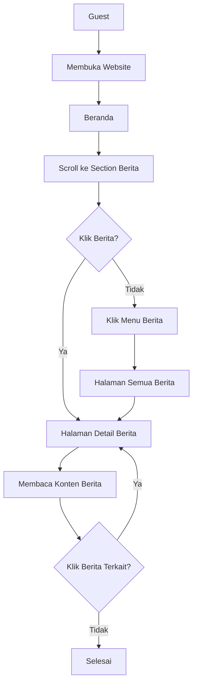
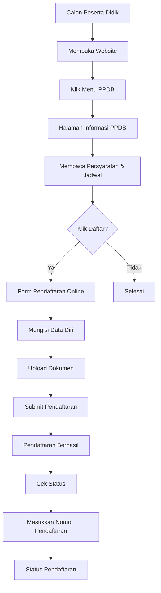
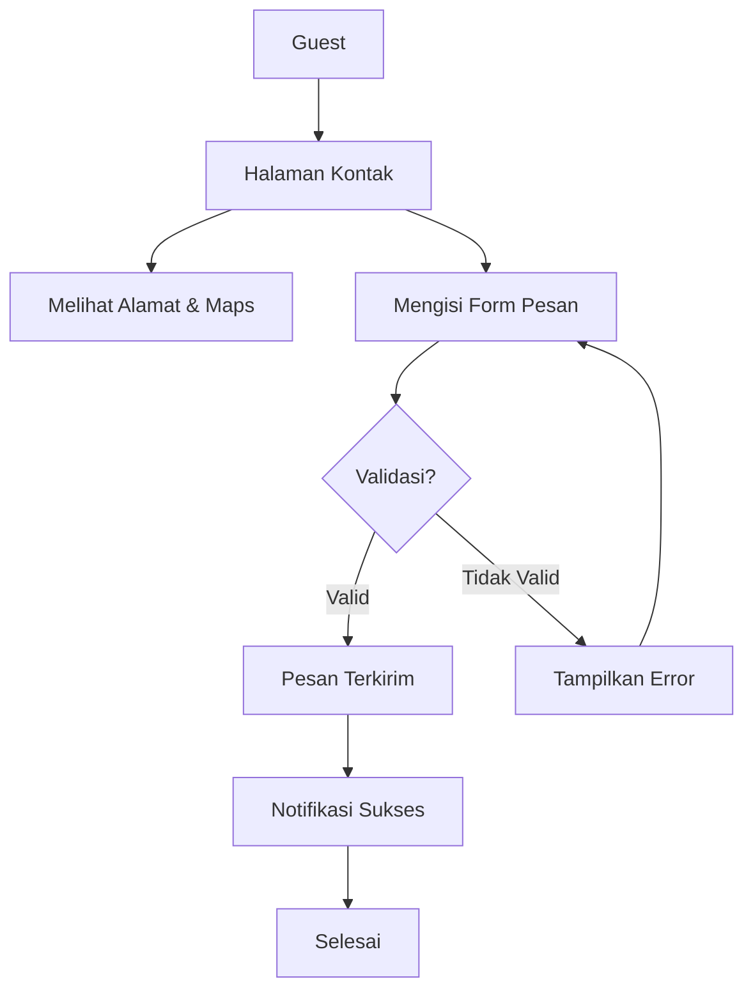
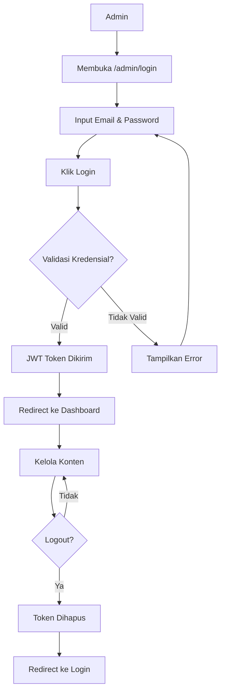
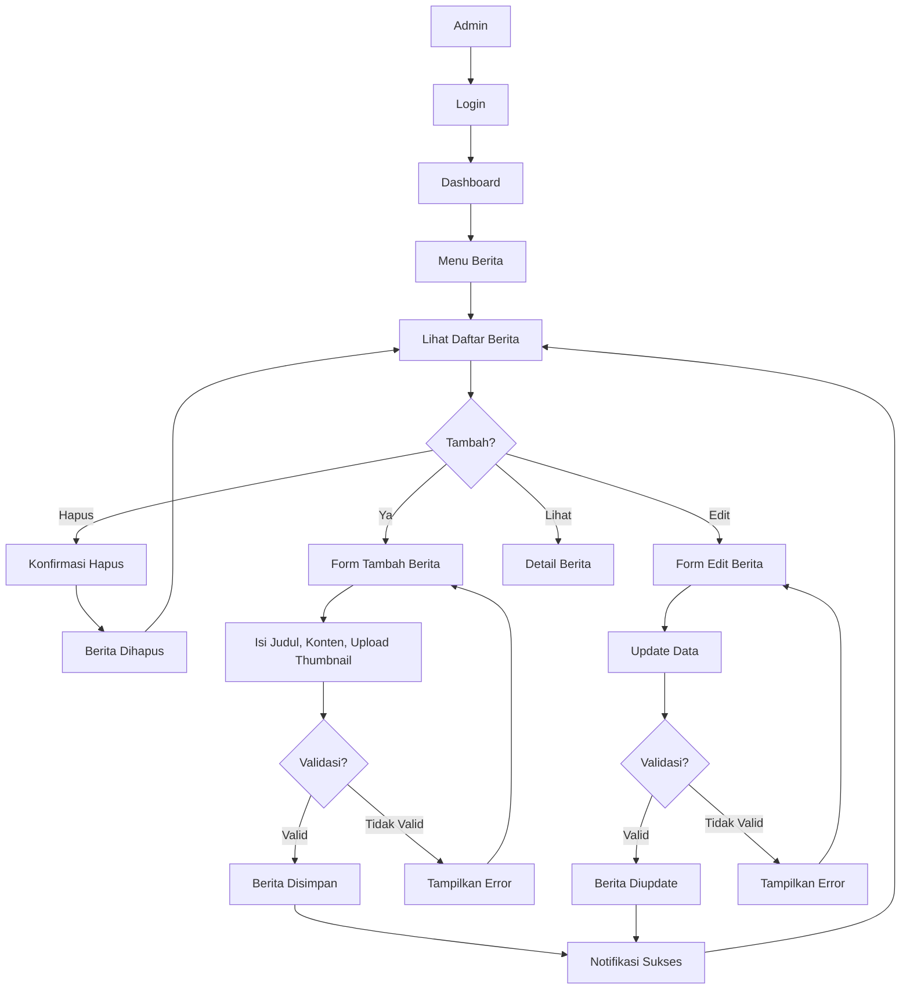
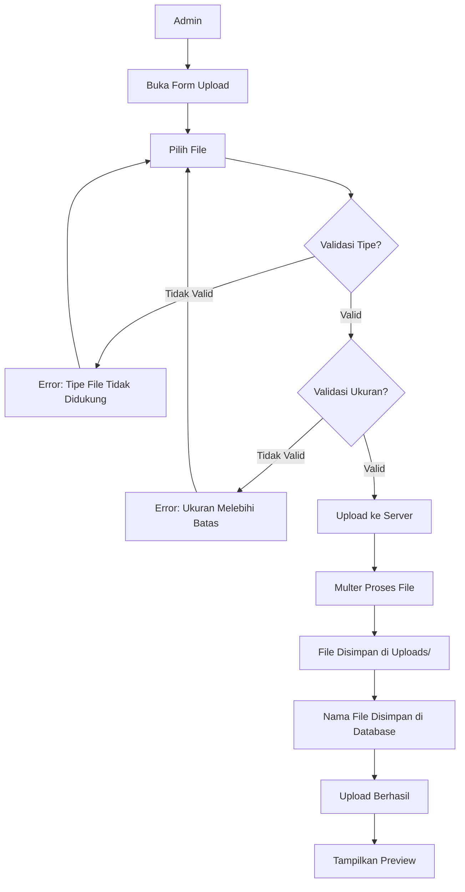

# Product Requirement Document (PRD)

## Website Profil Sekolah Dasar (SD)

---

**Dokumen**: PRD - Product Requirement Document
**Proyek**: Website Profil Sekolah Dasar
**Versi**: 1.0
**Tanggal**: 2025-01-01
**Status**: Draft

---

## Daftar Isi

1. [Pendahuluan](#1-pendahuluan)
2. [User Role](#2-user-role)
3. [Fitur Guest](#3-fitur-guest)
4. [Fitur Admin](#4-fitur-admin)
5. [Non Functional Requirement](#5-non-functional-requirement)
6. [User Flow](#6-user-flow)
7. [Acceptance Criteria](#7-acceptance-criteria)

---

## 1. Pendahuluan

### 1.1 Latar Belakang

Di era digital saat ini, kebutuhan akan informasi yang cepat, akurat, dan mudah diakses menjadi sangat penting. Sekolah Dasar sebagai institusi pendidikan memerlukan media informasi resmi yang dapat menjangkau masyarakat luas, khususnya orang tua dan calon peserta didik.

Website profil sekolah saat ini masih banyak yang menggunakan platform statis atau CMS yang sulit dikustomisasi, tidak responsif, dan sulit dikelola oleh pihak sekolah. Oleh karena itu, dibutuhkan sebuah website profil sekolah yang modern, dinamis, mudah dikelola, dan dapat diakses dari berbagai perangkat.

### 1.2 Tujuan Website

1. Menyediakan media informasi resmi Sekolah Dasar yang lengkap dan terpercaya.
2. Meningkatkan citra profesional sekolah melalui presence digital yang modern.
3. Memudahkan calon peserta didik dan orang tua dalam memperoleh informasi sekolah.
4. Menyediakan sistem PPDB (Penerimaan Peserta Didik Baru) secara online.
5. Memberikan kemudahan bagi admin sekolah dalam mengelola konten website secara mandiri.
6. Meningkatkan jangkauan promosi dan branding sekolah.
7. Menyediakan arsip digital berita, prestasi, dan dokumentasi kegiatan sekolah.

### 1.3 Sasaran Pengguna

| Sasaran | Deskripsi |
|---------|-----------|
| Orang Tua / Wali Murid | Mencari informasi profil, fasilitas, kurikulum, dan biaya sekolah |
| Calon Peserta Didik | Mendaftar PPDB dan melihat informasi pendaftaran |
| Masyarakat Umum | Melihat berita, prestasi, dan kegiatan sekolah |
| Guru dan Staff | Mengelola konten dan data yang menjadi tanggung jawabnya |
| Kepala Sekolah | Memberikan sambutan dan memantau publikasi sekolah |
| Admin Sekolah | Mengelola seluruh konten website dan data pengguna |
| Dinas Pendidikan | Memantau informasi publik sekolah |

---

## 2. User Role

### 2.1 Guest

Pengguna yang mengakses website tanpa melakukan autentikasi. Guest dapat mengakses seluruh halaman publik.

**Hak Akses:**
- Melihat seluruh halaman publik
- Mendaftar PPDB
- Mengirim pesan melalui form kontak
- Melihat dan mencari berita, pengumuman, agenda
- Mengunduh dokumen publik

### 2.2 Admin

Pengguna yang telah melakukan login dan memiliki akses ke panel administrasi.

**Hak Akses:**
- Mengelola dashboard admin
- Mengelola profil sekolah
- CRUD Guru dan Staff
- CRUD Berita, Pengumuman, Agenda
- CRUD Prestasi, Galeri Foto, Video
- CRUD Slider, Banner, Menu, Footer
- CRUD PPDB, Testimoni, FAQ
- CRUD User Admin
- Mengunggah dan menghapus file
- Mengelola pengaturan website
- Melihat log aktivitas

---

## 3. Fitur Guest

### 3.1 Beranda

Halaman utama website yang menampilkan:
- Slider hero dengan gambar dan teks
- Sambutan singkat kepala sekolah
- Berita terbaru (3-6 item)
- Prestasi terbaru (3-6 item)
- Pengumuman terbaru (3-6 item)
- Agenda mendatang (3-6 item)
- Galeri foto terbaru
- Testimoni
- Lokasi Google Maps
- Footer dengan informasi kontak

### 3.2 Profil Sekolah

Halaman profil yang berisi informasi lengkap tentang sekolah:
- Sambutan Kepala Sekolah
- Sejarah Sekolah
- Visi dan Misi
- Struktur Organisasi (bagan)
- Data Guru dan Staff
- Data Prestasi
- Fasilitas Sekolah
- Program Sekolah

### 3.3 Sambutan Kepala Sekolah

Halaman yang menampilkan:
- Foto Kepala Sekolah
- Nama dan gelar
- Sambutan / kata pengantar
- Riwayat singkat

### 3.4 Sejarah Sekolah

Halaman yang menampilkan:
- Timeline sejarah berdirinya sekolah
- Tahun penting dalam perjalanan sekolah
- Dokumentasi foto sejarah

### 3.5 Visi dan Misi

Halaman yang menampilkan:
- Visi sekolah
- Misi sekolah (poin-poin)
- Tujuan sekolah
- Motto sekolah

### 3.6 Struktur Organisasi

Halaman yang menampilkan:
- Bagan struktur organisasi sekolah
- Nama dan jabatan setiap posisi
- Foto (jika tersedia)

### 3.7 Guru dan Staff

Halaman yang menampilkan daftar:
- Guru (dengan filter berdasarkan bidang)
- Staff Tata Usaha
- Informasi: nama, foto, mapel (untuk guru), jabatan

### 3.8 Data Prestasi

Halaman yang menampilkan:
- Prestasi akademik
- Prestasi non-akademik
- Filter berdasarkan tahun dan kategori
- Informasi: judul, juara, tingkat, tahun, foto

### 3.9 Fasilitas

Halaman yang menampilkan daftar fasilitas sekolah:
- Ruang Kelas
- Laboratorium
- Perpustakaan
- Lapangan Olahraga
- UKS
- Kantin
- Tempat Ibadah
- Dan lain-lain

### 3.10 Program Sekolah

Halaman yang menampilkan program-program unggulan sekolah:
- Program Akademik
- Program Ekstrakurikuler
- Program Keagamaan
- Program Keterampilan

### 3.11 Berita

Halaman berita yang menampilkan:
- Daftar berita terkini (dengan pagination)
- Kategori berita
- Pencarian berita
- Halaman detail berita (gambar, konten, tanggal, penulis, kategori)
- Berita terkait

### 3.12 Pengumuman

Halaman pengumuman yang menampilkan:
- Daftar pengumuman terkini
- Status pengumuman (penting / biasa)
- Halaman detail pengumuman
- Filter berdasarkan tanggal

### 3.13 Agenda

Halaman agenda yang menampilkan:
- Kalender agenda
- Daftar agenda mendatang
- Detail agenda: nama, tanggal, jam, tempat, deskripsi
- Filter berdasarkan bulan

### 3.14 Album Foto

Halaman galeri foto yang menampilkan:
- Album-album foto
- Grid foto thumbnail
- Lightbox untuk melihat foto ukuran penuh
- Keterangan setiap foto

### 3.15 Video

Halaman video yang menampilkan:
- Daftar video (YouTube embed)
- Kategori video
- Deskripsi video

### 3.16 Download Dokumen

Halaman download yang menampilkan:
- Daftar dokumen yang dapat diunduh
- Kategori dokumen
- Informasi: nama file, ukuran, tipe, tanggal upload

### 3.17 PPDB

Halaman Penerimaan Peserta Didik Baru yang menampilkan:
- Informasi pendaftaran
- Persyaratan
- Jalur pendaftaran
- Biaya
- Timeline PPDB
- Form pendaftaran online
- Status pendaftaran (cek status)

### 3.18 FAQ

Halaman Frequently Asked Questions yang menampilkan:
- Daftar pertanyaan dan jawaban
- Kategori FAQ
- Accordion / collapse interaktif

### 3.19 Kontak

Halaman kontak yang menampilkan:
- Alamat sekolah
- Nomor telepon
- Email
- Social media
- Form pesan / saran

### 3.20 Lokasi Google Maps

Embed Google Maps yang menampilkan lokasi sekolah.

---

## 4. Fitur Admin

### 4.1 Dashboard Admin

Halaman utama admin yang menampilkan:
- Ringkasan statistik (jumlah berita, guru, siswa, pengumuman)
- Grafik kunjungan (jika ada)
- Aktivitas terbaru
- Notifikasi

### 4.2 Login Admin

Halaman login dengan:
- Form email dan password
- Remember me
- Captcha (opsional)
- Proteksi brute force

### 4.3 Logout Admin

Proses logout yang mengakhiri session dan menghapus token JWT.

### 4.4 CRUD Profil Sekolah

- Mengelola informasi profil sekolah
- Mengelola sambutan kepala sekolah
- Mengelola sejarah, visi misi, struktur organisasi
- Upload foto kepala sekolah dan logo

### 4.5 CRUD Guru

- Tambah, lihat, edit, hapus data guru
- Upload foto guru
- Atribut: nama, nip, mapel, jabatan, pendidikan, foto

### 4.6 CRUD Staff

- Tambah, lihat, edit, hapus data staff
- Upload foto staff
- Atribut: nama, nip, jabatan, bagian, foto

### 4.7 CRUD Berita

- Tambah, lihat, edit, hapus berita
- Upload gambar/thumbnail
- Editor konten (WYSIWYG)
- Atribut: judul, konten, kategori, thumbnail, penulis, status publish

### 4.8 CRUD Pengumuman

- Tambah, lihat, edit, hapus pengumuman
- Atribut: judul, konten, status, tanggal

### 4.9 CRUD Agenda

- Tambah, lihat, edit, hapus agenda
- Atribut: nama, tanggal mulai, tanggal selesai, jam, tempat, deskripsi

### 4.10 CRUD Prestasi

- Tambah, lihat, edit, hapus prestasi
- Upload foto/sertifikat
- Atribut: judul, kategori, juara, tingkat, tahun, keterangan

### 4.11 CRUD Galeri Foto

- Tambah, lihat, edit, hapus album galeri
- Upload multiple foto dalam album
- Atribut album: judul, deskripsi, cover
- Atribut foto: file, caption

### 4.12 CRUD Video

- Tambah, lihat, edit, hapus video
- Atribut: judul, url YouTube, deskripsi, kategori

### 4.13 CRUD Download

- Tambah, lihat, edit, hapus dokumen download
- Upload file
- Atribut: judul, file, kategori, deskripsi

### 4.14 CRUD Slider

- Tambah, lihat, edit, hapus slider hero
- Upload gambar slider
- Atribut: judul, teks, gambar, link, urutan, status

### 4.15 CRUD Banner

- Tambah, lihat, edit, hapus banner
- Upload gambar banner
- Atribut: judul, gambar, link, posisi, status

### 4.16 CRUD Menu

- Tambah, lihat, edit, hapus menu navigasi
- Atribut: nama, link, parent, urutan, icon, status
- Menu bertingkat (parent-child)

### 4.17 CRUD Footer

- Mengelola konten footer
- Informasi kontak
- Link sosial media
- Copyright

### 4.18 CRUD PPDB

- Mengatur jadwal dan gelombang PPDB
- Melihat data pendaftar
- Mengubah status pendaftar
- Export data pendaftar

### 4.19 CRUD Testimoni

- Tambah, lihat, edit, hapus testimoni
- Atribut: nama, asal, foto, teks, rating, status

### 4.20 CRUD FAQ

- Tambah, lihat, edit, hapus FAQ
- Atribut: pertanyaan, jawaban, kategori, urutan

### 4.21 CRUD User Admin

- Tambah, lihat, edit, hapus user admin
- Atribut: nama, email, password, role, status
- Tidak dapat menghapus diri sendiri

---

## 5. Non Functional Requirement

### 5.1 Responsive

- Website harus responsif di perangkat desktop (1366px+), tablet (768px - 1365px), dan mobile (320px - 767px).
- Menggunakan CSS3 murni tanpa framework CSS.
- Implementasi media queries untuk setiap breakpoint.
- Navigasi mobile menggunakan hamburger menu.

### 5.2 SEO

- Semantic HTML5 tags (header, nav, main, section, article, footer).
- Meta tags untuk setiap halaman (title, description, keywords).
- Open Graph tags untuk sharing sosial media.
- JSON-LD structured data untuk sekolah.
- Sitemap.xml otomatis.
- Robots.txt.
- URL slug yang ramah SEO.
- ALT text pada gambar.
- Heading hierarchy yang benar.

### 5.3 Security

- Autentikasi menggunakan JWT (JSON Web Token).
- Token disimpan di httpOnly cookie atau localStorage.
- Proteksi route di backend menggunakan middleware.
- Validasi input di client dan server.
- Sanitasi input untuk mencegah XSS dan SQL Injection.
- Rate limiting pada endpoint publik.
- Helmet.js untuk security headers.
- CORS configuration.
- Brute force protection pada login.
- File upload validation (tipe dan ukuran).

### 5.4 Fast Loading

- Optimasi gambar (kompresi, webp jika memungkinkan).
- Lazy loading untuk gambar.
- Minifikasi CSS dan JavaScript.
- Caching pada server (response cache).
- Database query optimization.
- Pagination untuk data list.
- Compression (gzip/brotli).
- CDN untuk asset statis.

### 5.5 Clean Architecture

- Memisahkan backend dan frontend.
- MVC pattern di backend.
- Component-based architecture di frontend.
- Service layer untuk business logic.
- Repository pattern untuk database access.
- Environment variables untuk konfigurasi.

### 5.6 MVC (Model-View-Controller)

- Model: Representasi data dan interaksi database.
- View: Frontend React.js (public) dan halaman admin.
- Controller: Menangani request dan response API.

### 5.7 REST API

- API mengikuti prinsip RESTful.
- HTTP methods: GET, POST, PUT, DELETE.
- Response format JSON dengan struktur konsisten.
- Status code yang sesuai (200, 201, 400, 401, 403, 404, 500).
- API versioning (/api/v1/...).
- Error handling yang jelas.

### 5.8 Authentication JWT

- Login menghasilkan access token (short-lived) dan refresh token (long-lived).
- Setiap request ke protected route menyertakan token.
- Token expired menghasilkan response 401.
- Middleware memverifikasi token sebelum melanjutkan ke controller.

### 5.9 Upload File

- Menggunakan Multer untuk menangani upload file.
- Validasi tipe file (images: jpg, png, webp; documents: pdf, doc, xls).
- Batas ukuran file (gambar: max 2MB, dokumen: max 10MB).
- Penyimpanan file di folder uploads/.
- Penamaan file menggunakan timestamp + random string.
- Hapus file lama saat update (jika diperlukan).

### 5.10 Validation

- Validasi input di frontend (form validation).
- Validasi input di backend (express-validator).
- Pesan error yang jelas dan informatif.
- Sanitasi input untuk menghindari XSS.

### 5.11 Error Handling

- Global error handler di backend.
- Error response dengan format konsisten:

```json
{
  "success": false,
  "message": "Error message",
  "errors": []
}
```

- Logging error ke file.
- Fallback error page di frontend.

### 5.12 Logging

- Morgan untuk HTTP request logging.
- Winston untuk error logging.
- Log disimpan di folder logs/.
- Log rotasi harian.

---

## 6. User Flow

### 6.1 User Flow Guest (Melihat Berita)



### 6.2 User Flow Guest (PPDB)



### 6.3 User Flow Guest (Kontak)



### 6.4 User Flow Admin (Login)



### 6.5 User Flow Admin (CRUD Berita)



### 6.6 User Flow Admin (Upload File)



---

## 7. Acceptance Criteria

### 7.1 Halaman Beranda

| ID | Kriteria | Status |
|----|----------|--------|
| AC-01 | Slider hero muncul dengan animasi dan navigasi dot | |
| AC-02 | Sambutan kepala sekolah muncul dengan foto dan teks | |
| AC-03 | Berita terbaru maksimal 6 item tampil dalam grid | |
| AC-04 | Prestasi terbaru tampil dengan rapi | |
| AC-05 | Pengumuman penting tampil di section khusus | |
| AC-06 | Agenda mendatang tampil dengan tanggal | |
| AC-07 | Galeri foto preview tampil dalam grid | |
| AC-08 | Testimoni tampil dengan slider/carousel | |
| AC-09 | Google Maps menampilkan lokasi sekolah | |
| AC-10 | Footer menampilkan informasi kontak lengkap | |
| AC-11 | Semua link navigasi berfungsi dengan benar | |

### 7.2 Halaman Profil Sekolah

| ID | Kriteria | Status |
|----|----------|--------|
| AC-12 | Halaman profil menampilkan semua sub-profil | |
| AC-13 | Sambutan kepala sekolah memiliki foto dan teks lengkap | |
| AC-14 | Sejarah sekolah ditampilkan dalam timeline | |
| AC-15 | Visi dan misi ditampilkan dengan format jelas | |
| AC-16 | Struktur organisasi ditampilkan dalam bentuk bagan | |

### 7.3 Halaman Guru dan Staff

| ID | Kriteria | Status |
|----|----------|--------|
| AC-17 | Daftar guru ditampilkan dalam grid dengan foto | |
| AC-18 | Filter berdasarkan bidang/mapel berfungsi | |
| AC-19 | Data staff TU ditampilkan terpisah | |
| AC-20 | Pencarian guru berfungsi | |

### 7.4 Halaman Prestasi

| ID | Kriteria | Status |
|----|----------|--------|
| AC-21 | Daftar prestasi ditampilkan dengan rapi | |
| AC-22 | Filter berdasarkan tahun dan kategori berfungsi | |
| AC-23 | Foto/sertifikat prestasi dapat diperbesar | |
| AC-24 | Pagination berfungsi jika data banyak | |

### 7.5 Halaman Berita

| ID | Kriteria | Status |
|----|----------|--------|
| AC-25 | Daftar berita ditampilkan dengan thumbnail dan judul | |
| AC-26 | Pagination berfungsi dengan benar | |
| AC-27 | Filter kategori berfungsi | |
| AC-28 | Pencarian berita berdasarkan judul berfungsi | |
| AC-29 | Halaman detail menampilkan konten lengkap | |
| AC-30 | Berita terkait muncul di halaman detail | |
| AC-31 | URL menggunakan slug yang ramah SEO | |

### 7.6 Halaman Galeri Foto

| ID | Kriteria | Status |
|----|----------|--------|
| AC-32 | Album foto ditampilkan dalam grid | |
| AC-33 | Klik album menampilkan foto-foto di dalamnya | |
| AC-34 | Lightbox berfungsi untuk melihat foto ukuran penuh | |
| AC-35 | Navigasi foto di lightbox berfungsi | |
| AC-36 | Caption foto ditampilkan | |

### 7.7 Halaman Video

| ID | Kriteria | Status |
|----|----------|--------|
| AC-37 | Video thumbnail ditampilkan dengan play button | |
| AC-38 | Klik video memutar embed YouTube | |
| AC-39 | Kategori video berfungsi sebagai filter | |

### 7.8 Halaman Download

| ID | Kriteria | Status |
|----|----------|--------|
| AC-40 | Daftar dokumen ditampilkan dengan informasi lengkap | |
| AC-41 | Link download berfungsi mengunduh file | |
| AC-42 | Filter kategori berfungsi | |

### 7.9 Halaman PPDB

| ID | Kriteria | Status |
|----|----------|--------|
| AC-43 | Informasi PPDB ditampilkan dengan lengkap | |
| AC-44 | Form pendaftaran online berfungsi dengan validasi | |
| AC-45 | Upload dokumen persyaratan berfungsi | |
| AC-46 | Notifikasi pendaftaran berhasil muncul | |
| AC-47 | Cek status pendaftaran berfungsi | |

### 7.10 Halaman FAQ

| ID | Kriteria | Status |
|----|----------|--------|
| AC-48 | Semua FAQ ditampilkan dalam accordion | |
| AC-49 | Klik pertanyaan membuka jawaban dengan animasi | |
| AC-50 | Filter kategori berfungsi | |

### 7.11 Halaman Kontak

| ID | Kriteria | Status |
|----|----------|--------|
| AC-51 | Alamat, telepon, email ditampilkan dengan jelas | |
| AC-52 | Google Maps menampilkan lokasi yang benar | |
| AC-53 | Form kirim pesan berfungsi dengan validasi | |
| AC-54 | Notifikasi pesan terkirim muncul | |

### 7.12 Admin Login

| ID | Kriteria | Status |
|----|----------|--------|
| AC-55 | Form login menampilkan input email dan password | |
| AC-56 | Login dengan kredensial valid masuk ke dashboard | |
| AC-57 | Login dengan kredensial tidak valid menampilkan error | |
| AC-58 | Session timeout setelah tidak aktif | |
| AC-59 | Token JWT expired menampilkan pesan dan redirect login | |

### 7.13 Admin Dashboard

| ID | Kriteria | Status |
|----|----------|--------|
| AC-60 | Dashboard menampilkan statistik utama | |
| AC-61 | Grafik atau chart data sekolah tampil | |
| AC-62 | Aktivitas terbaru ditampilkan | |
| AC-63 | Navigasi sidebar berfungsi ke semua menu | |

### 7.14 Admin CRUD

| ID | Kriteria | Status |
|----|----------|--------|
| AC-64 | Tabel data menampilkan informasi lengkap | |
| AC-65 | Tombol tambah data membuka form kosong | |
| AC-66 | Tombol edit membuka form dengan data terisi | |
| AC-67 | Tombol hapus menampilkan konfirmasi sebelum menghapus | |
| AC-68 | Form validasi menampilkan error jika input tidak valid | |
| AC-69 | Data berhasil disimpan menampilkan notifikasi sukses | |
| AC-70 | Upload file berfungsi dengan validasi tipe dan ukuran | |
| AC-71 | Pagination berfungsi jika data lebih dari 10 item | |
| AC-72 | Pencarian data berfungsi | |

### 7.15 Responsive Design

| ID | Kriteria | Status |
|----|----------|--------|
| AC-73 | Tampilan desktop optimal pada resolusi 1366px+ | |
| AC-74 | Tampilan tablet optimal pada resolusi 768px - 1365px | |
| AC-75 | Tampilan mobile optimal pada resolusi 320px - 767px | |
| AC-76 | Navigasi berubah menjadi hamburger menu di mobile | |
| AC-77 | Grid berubah menjadi 1 kolom di mobile | |
| AC-78 | Gambar menyesuaikan ukuran layar | |
| AC-79 | Tidak ada scroll horizontal | |
| AC-80 | Touch friendly pada perangkat mobile | |

---

## 8. Glossary

| Istilah | Definisi |
|---------|----------|
| CRUD | Create, Read, Update, Delete - operasi dasar manajemen data |
| JWT | JSON Web Token - standar untuk token autentikasi |
| PPDB | Penerimaan Peserta Didik Baru |
| REST API | Representational State Transfer Application Programming Interface |
| SEO | Search Engine Optimization |
| MVC | Model-View-Controller |
| Multer | Middleware Node.js untuk menangani multipart/form-data (upload file) |
| Guest | Pengguna yang belum login |
| Admin | Pengguna yang memiliki akses ke panel administrasi |
| Hero | Bagian atas halaman utama dengan slider atau gambar besar |
| Slider | Komponen yang menampilkan beberapa slide gambar secara bergantian |
| Lightbox | Komponen untuk menampilkan gambar dalam overlay ukuran penuh |
| Accordion | Komponen expand/collapse untuk menyembunyikan atau menampilkan konten |
| Toast | Notifikasi kecil yang muncul sementara |

---

## 9. Dokumen Terkait

- [System Design](./SYSTEM_DESIGN.md)
- [Database Design](./DATABASE.md)
- [UI/UX Guidelines](./UI_UX.md)
- [Project Structure](./PROJECT_STRUCTURE.md)
- [Roadmap](./ROADMAP.md)

---
