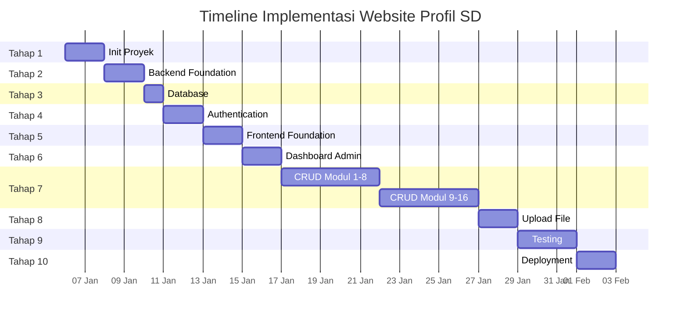

# Roadmap Implementation

## Website Profil Sekolah Dasar (SD)

---

**Dokumen**: ROADMAP - Implementation Roadmap
**Proyek**: Website Profil Sekolah Dasar
**Versi**: 1.0
**Tanggal**: 2025-01-01
**Status**: Draft

---

## Daftar Isi

1. [Ringkasan Timeline](#1-ringkasan-timeline)
2. [Tahap 1: Project Initialization](#2-tahap-1-project-initialization)
3. [Tahap 2: Backend Foundation](#3-tahap-2-backend-foundation)
4. [Tahap 3: Database](#4-tahap-3-database)
5. [Tahap 4: Authentication](#5-tahap-4-authentication)
6. [Tahap 5: Frontend Foundation](#6-tahap-5-frontend-foundation)
7. [Tahap 6: Dashboard Admin](#7-tahap-6-dashboard-admin)
8. [Tahap 7: CRUD Semua Modul](#8-tahap-7-crud-semua-modul)
9. [Tahap 8: Upload File](#9-tahap-8-upload-file)
10. [Tahap 9: Testing](#10-tahap-9-testing)
11. [Tahap 10: Deployment](#11-tahap-10-deployment)
12. [Urutan Implementasi API](#12-urutan-implementasi-api)
13. [Urutan Implementasi Frontend](#13-urutan-implementasi-frontend)
14. [Urutan Testing](#14-urutan-testing)
15. [Deployment Checklist](#15-deployment-checklist)

---

## 1. Ringkasan Timeline

### 1.1 Milestone

| Milestone | Target | Durasi | Output |
|-----------|--------|--------|--------|
| M1 | Akhir Minggu 1 | 5 hari | Project siap, backend foundation, database selesai |
| M2 | Akhir Minggu 2 | 5 hari | Auth selesai, frontend foundation, dashboard admin |
| M3 | Akhir Minggu 4 | 10 hari | CRUD modul 1-8 selesai |
| M4 | Akhir Minggu 6 | 10 hari | CRUD modul 9-16 selesai, upload file |
| M5 | Akhir Minggu 7 | 5 hari | Testing selesai, deployment siap |

**Total Estimasi: 7 Minggu (35 Hari Kerja)**

### 1.2 Timeline Mingguan



### 1.3 Sprint Plan

| Sprint | Minggu | Fokus |
|--------|--------|-------|
| Sprint 1 | Minggu 1 | Inisialisasi, Backend Foundation, Database, Auth |
| Sprint 2 | Minggu 2 | Frontend Foundation, Dashboard, Halaman Publik |
| Sprint 3 | Minggu 3-4 | CRUD Modul Inti (Profil, Guru, Berita, Prestasi, Galeri) |
| Sprint 4 | Minggu 5-6 | CRUD Modul Lanjutan (PPDB, Slider, Menu, dll), Upload |
| Sprint 5 | Minggu 7 | Testing, Bug Fixing, Deployment |

---

## 2. Tahap 1: Project Initialization

### 2.1 Informasi

| Item | Detail |
|------|--------|
| **Tujuan** | Setup awal project, struktur folder, dan konfigurasi dasar |
| **Dependency** | - |
| **Estimasi** | 2 hari |
| **Output** | Repository siap dengan struktur project lengkap |

### 2.2 Task Checklist

- [ ] Buat repository Git (GitHub/GitLab)
- [ ] Setup struktur folder project
- [ ] Inisialisasi package.json backend (`npm init -y`)
- [ ] Inisialisasi project frontend dengan Vite
- [ ] Setup .gitignore
- [ ] Buat file .env.example untuk backend dan frontend
- [ ] Setup ESLint dan Prettier
- [ ] Buat README.md
- [ ] Setup dokumentasi di folder docs/
- [ ] Commit pertama: "chore: initial project setup"

---

## 3. Tahap 2: Backend Foundation

### 3.1 Informasi

| Item | Detail |
|------|--------|
| **Tujuan** | Setup server Express.js, konfigurasi, dan struktur backend |
| **Dependency** | Tahap 1 |
| **Estimasi** | 2 hari |
| **Output** | Server Express siap berjalan dengan struktur yang lengkap |

### 3.2 Task Checklist

- [ ] Install dependencies backend
- [ ] Setup konfigurasi environment (dotenv)
- [ ] Buat file `app.js` (konfigurasi Express)
- [ ] Buat file `server.js` (entry point)
- [ ] Setup koneksi database MySQL (mysql2 pool)
- [ ] Setup middleware global (cors, helmet, morgan, json parser)
- [ ] Setup error handling middleware
- [ ] Setup logging (winston)
- [ ] Setup route index (`routes/index.js`)
- [ ] Buat struktur folder controllers, models, routes, middlewares, services, utils
- [ ] Setup response helper (`utils/response.js`)
- [ ] Setup rate limiting
- [ ] Testing: Server berjalan di port 5000

### 3.3 API Implementasi

```text
GET  /api/health → { status: 'ok', timestamp: ... }
```

---

## 4. Tahap 3: Database

### 4.1 Informasi

| Item | Detail |
|------|--------|
| **Tujuan** | Membuat database dan seluruh tabel |
| **Dependency** | Tahap 2 |
| **Estimasi** | 1 hari |
| **Output** | Database MySQL dengan seluruh tabel dan relasi |

### 4.2 Task Checklist

- [ ] Buat database MySQL: `school_profile`
- [ ] Buat migration files untuk semua tabel
- [ ] Buat tabel: roles, users, menus, settings
- [ ] Buat tabel: school_profiles, teachers, staffs, student_statistics
- [ ] Buat tabel: achievements, facilities, programs
- [ ] Buat tabel: news_categories, news
- [ ] Buat tabel: announcements, events
- [ ] Buat tabel: galleries, gallery_images
- [ ] Buat tabel: videos, downloads
- [ ] Buat tabel: faqs, testimonials
- [ ] Buat tabel: sliders, banners
- [ ] Buat tabel: contacts, messages
- [ ] Buat tabel: ppdb, social_media
- [ ] Buat tabel: logs
- [ ] Buat seed data: roles, admin user, settings, default menu
- [ ] Testing: Semua tabel terbuat dan seed berhasil

### 4.3 Dependency Tabel

```text
roles (no dependency)
  └── users (depends on roles)
menus (self-referencing)
news_categories (no dependency)
  └── news (depends on news_categories)
galleries (no dependency)
  └── gallery_images (depends on galleries)

All other tables: no dependencies
```

---

## 5. Tahap 4: Authentication

### 5.1 Informasi

| Item | Detail |
|------|--------|
| **Tujuan** | Membuat sistem autentikasi JWT untuk admin |
| **Dependency** | Tahap 2, 3 |
| **Estimasi** | 2 hari |
| **Output** | Login/logout admin dengan JWT |

### 5.2 Task Checklist

**Backend:**
- [ ] Buat model User
- [ ] Buat model Role
- [ ] Buat authService (login, register, verifyToken)
- [ ] Buat authController (login, logout, me, refreshToken)
- [ ] Buat authValidator (login validation)
- [ ] Buat authMiddleware (verify token)
- [ ] Buat route auth: POST /api/auth/login
- [ ] Buat route auth: POST /api/auth/logout
- [ ] Buat route auth: GET /api/auth/me
- [ ] Buat route auth: POST /api/auth/refresh
- [ ] Generate bcrypt hash untuk password admin seed
- [ ] Testing: Login dengan kredensial valid

**Frontend:**
- [ ] Setup Axios instance (`services/api.js`)
- [ ] Buat authService frontend
- [ ] Buat AuthContext
- [ ] Buat useAuth hook
- [ ] Buat halaman Login
- [ ] Buat ProtectedRoute component
- [ ] Testing: Flow login dari frontend

### 5.3 Flow Auth Implementation

```text
Day 1:
  - Backend auth (model, service, controller, routes)
  - Testing auth endpoint dengan Postman

Day 2:
  - Frontend auth (service, context, hook, login page)
  - Protected route
  - Integration test login flow
```

---

## 6. Tahap 5: Frontend Foundation

### 6.1 Informasi

| Item | Detail |
|------|--------|
| **Tujuan** | Setup React, routing, layout, dan komponen dasar |
| **Dependency** | Tahap 1 |
| **Estimasi** | 2 hari |
| **Output** | Frontend dengan routing, layout, dan komponen UI dasar |

### 6.2 Task Checklist

- [ ] Setup Vite React project
- [ ] Install dependencies frontend
- [ ] Setup folder structure
- [ ] Setup CSS variables dan reset
- [ ] Buat komponen common: Button, Card, Input, Select, Modal
- [ ] Buat komponen common: Table, Pagination, Loading, EmptyState, ErrorState
- [ ] Buat komponen common: Badge, Avatar, Breadcrumb, SearchInput
- [ ] Buat komponen UI: Toast, Alert, Tabs, Accordion
- [ ] Buat komponen UI: Lightbox, Slider, DataTable
- [ ] Buat layout: PublicLayout, PublicHeader, PublicFooter, PublicNavbar
- [ ] Buat layout: AdminLayout, AdminSidebar, AdminHeader
- [ ] Setup React Router (Public & Admin routes)
- [ ] Buat halaman 404
- [ ] Setup responsive CSS (mobile, tablet, desktop)

---

## 7. Tahap 6: Dashboard Admin

### 7.1 Informasi

| Item | Detail |
|------|--------|
| **Tujuan** | Membuat halaman dashboard admin dengan statistik |
| **Dependency** | Tahap 4, 5 |
| **Estimasi** | 2 hari |
| **Output** | Dashboard admin dengan statistik real-time |

### 7.2 Task Checklist

**Backend:**
- [ ] Buat dashboardController
- [ ] Buat endpoint GET /api/dashboard/stats
- [ ] Buat endpoint GET /api/dashboard/recent-activities
- [ ] Buat model Log

**Frontend:**
- [ ] Buat halaman DashboardPage
- [ ] Buat StatCard component
- [ ] Buat ChartWidget component
- [ ] Buat ActivityLog component
- [ ] Buat RecentMessages widget
- [ ] Buat UpcomingEvents widget

---

## 8. Tahap 7: CRUD Semua Modul

### 8.1 Informasi

| Item | Detail |
|------|--------|
| **Tujuan** | Implementasi CRUD untuk semua modul backend dan frontend |
| **Dependency** | Tahap 4, 5, 6 |
| **Estimasi** | 10 hari (2 sprint) |
| **Output** | Seluruh fitur CRUD dapat digunakan |

### 8.2 Modul CRUD

**Sprint 3 (Minggu 3-4): Modul Inti**

| # | Modul | Backend | Frontend Publik | Frontend Admin | Durasi |
|---|-------|---------|-----------------|----------------|--------|
| 1 | School Profile | 0.5 hari | 0.5 hari | 0.5 hari | 1.5 hari |
| 2 | Teachers | 0.5 hari | 0.5 hari | 0.5 hari | 1.5 hari |
| 3 | Staffs | 0.25 hari | 0.25 hari | 0.25 hari | 0.75 hari |
| 4 | News + Categories | 1 hari | 1 hari | 1 hari | 3 hari |
| 5 | Announcements | 0.25 hari | 0.25 hari | 0.25 hari | 0.75 hari |
| 6 | Events | 0.25 hari | 0.5 hari | 0.25 hari | 1 hari |
| 7 | Achievements | 0.5 hari | 0.5 hari | 0.5 hari | 1.5 hari |
| 8 | Facilities | 0.25 hari | 0.25 hari | 0.25 hari | 0.75 hari |

**Sprint 4 (Minggu 5-6): Modul Lanjutan**

| # | Modul | Backend | Frontend Publik | Frontend Admin | Durasi |
|---|-------|---------|-----------------|----------------|--------|
| 9 | Programs | 0.25 hari | 0.25 hari | 0.25 hari | 0.75 hari |
| 10 | Galleries + Images | 0.5 hari | 1 hari | 0.5 hari | 2 hari |
| 11 | Videos | 0.25 hari | 0.5 hari | 0.25 hari | 1 hari |
| 12 | Downloads | 0.25 hari | 0.5 hari | 0.25 hari | 1 hari |
| 13 | Sliders | 0.25 hari | 0.5 hari | 0.25 hari | 1 hari |
| 14 | Banners | 0.25 hari | - | 0.25 hari | 0.5 hari |
| 15 | Menus | 0.5 hari | - | 0.5 hari | 1 hari |
| 16 | Footer | 0.25 hari | - | 0.25 hari | 0.5 hari |
| 17 | PPDB | 1 hari | 1.5 hari | 1 hari | 3.5 hari |
| 18 | Testimonials | 0.25 hari | 0.5 hari | 0.25 hari | 1 hari |
| 19 | FAQs | 0.25 hari | 0.5 hari | 0.25 hari | 1 hari |
| 20 | Contacts + Messages | 0.5 hari | 0.5 hari | 0.5 hari | 1.5 hari |
| 21 | Users | 0.5 hari | - | 0.5 hari | 1 hari |
| 22 | Settings | 0.25 hari | - | 0.5 hari | 0.75 hari |

### 8.3 Template CRUD Implementation

Setiap modul CRUD mengikuti pola yang sama:

**Backend:**
```
1. Buat model (query database)
2. Buat validators (express-validator rules)
3. Buat service (business logic)
4. Buat controller (handle request/response)
5. Buat routes (endpoint definitions)
6. Register di routes/index.js
```

**Frontend Admin:**
```
1. Buat service (API calls)
2. Buat halaman list (DataTable + filters)
3. Buat halaman form (create + edit)
4. Setup route di AdminRoutes
```

**Frontend Public:**
```
1. Buat halaman public (tampilkan data)
2. Buat halaman detail (jika perlu)
3. Setup route di PublicRoutes
```

---

## 9. Tahap 8: Upload File

### 9.1 Informasi

| Item | Detail |
|------|--------|
| **Tujuan** | Implementasi upload file menggunakan Multer |
| **Dependency** | Tahap 4, 7 |
| **Estimasi** | 2 hari |
| **Output** | Upload file berfungsi di semua modul yang memerlukan |

### 9.2 Task Checklist

**Backend:**
- [ ] Setup Multer configuration
- [ ] Buat uploadMiddleware dengan filter tipe dan ukuran
- [ ] Buat uploadController
- [ ] Buat service untuk manajemen file
- [ ] Implementasi delete file saat update/replace
- [ ] Buat route upload: POST /api/upload/image
- [ ] Buat route upload: POST /api/upload/document
- [ ] Buat route upload: DELETE /api/upload/:filename
- [ ] Integrasi upload ke modul: Teachers (foto)
- [ ] Integrasi upload ke modul: News (thumbnail)
- [ ] Integrasi upload ke modul: Galleries (album images)
- [ ] Integrasi upload ke modul: Sliders (gambar)
- [ ] Integrasi upload ke modul: PPDB (dokumen)
- [ ] Integrasi upload ke modul: Downloads (file)
- [ ] Testing: Upload, preview, delete file

**Frontend:**
- [ ] Buat FileUpload component
- [ ] Buat ImagePreview component
- [ ] Buat uploadService frontend
- [ ] Integrasi upload di form CRUD

### 9.3 File Upload Rules

| Module | Type | Max Size | Folder |
|--------|------|----------|--------|
| Teacher Photo | jpg, png, webp | 2MB | uploads/images/photos/ |
| News Thumbnail | jpg, png, webp | 2MB | uploads/images/thumbnails/ |
| Gallery Images | jpg, png, webp | 2MB | uploads/images/galleries/ |
| Slider Images | jpg, png, webp | 2MB | uploads/images/sliders/ |
| Banner Images | jpg, png, webp | 2MB | uploads/images/banners/ |
| PPDB Documents | pdf, jpg, png | 5MB | uploads/documents/ppdb/ |
| Download Files | pdf, doc, xls | 10MB | uploads/documents/downloads/ |

---

## 10. Tahap 9: Testing

### 10.1 Informasi

| Item | Detail |
|------|--------|
| **Tujuan** | Testing seluruh fitur aplikasi |
| **Dependency** | Tahap 7, 8 |
| **Estimasi** | 3 hari |
| **Output** | Aplikasi siap deployment dengan bugs minimal |

### 10.2 Testing Scope

| Hari | Fokus |
|------|-------|
| Day 1 | Backend API Testing (setiap endpoint) |
| Day 2 | Frontend Functional Testing + Responsive Testing |
| Day 3 | Integration Testing + Bug Fixing |

### 10.3 Task Checklist

**API Testing (Backend):**
- [ ] Test semua GET endpoints (response, pagination, filter)
- [ ] Test semua POST endpoints (create, validation)
- [ ] Test semua PUT endpoints (update, validation)
- [ ] Test semua DELETE endpoints (delete, cascade)
- [ ] Test auth (login, logout, token expired, invalid token)
- [ ] Test upload file (valid type, invalid type, size limit)
- [ ] Test error handling (404, 401, 400, 500)
- [ ] Test rate limiting
- [ ] Test CORS

**Functional Testing (Frontend):**
- [ ] Test semua halaman publik
- [ ] Test semua halaman admin
- [ ] Test form validation
- [ ] Test CRUD operations (tambah, edit, hapus)
- [ ] Test upload file
- [ ] Test search dan filter
- [ ] Test pagination
- [ ] Test toast/notification
- [ ] Test empty state dan error state
- [ ] Test loading state

**Responsive Testing:**
- [ ] Test desktop (1920x1080, 1366x768)
- [ ] Test tablet (1024x768, 768x1024)
- [ ] Test mobile (375x667, 414x896)
- [ ] Test navigasi mobile (hamburger menu)
- [ ] Test form di mobile
- [ ] Test tabel di mobile (horizontal scroll)

**Browser Testing:**
- [ ] Google Chrome
- [ ] Mozilla Firefox
- [ ] Microsoft Edge
- [ ] Safari (opsional)

---

## 11. Tahap 10: Deployment

### 11.1 Informasi

| Item | Detail |
|------|--------|
| **Tujuan** | Deployment aplikasi ke production |
| **Dependency** | Tahap 9 |
| **Estimasi** | 2 hari |
| **Output** | Aplikasi live dan dapat diakses publik |

### 11.2 Deployment Checklist

**Preparation:**
- [ ] Update .env untuk production
- [ ] Set NODE_ENV=production
- [ ] Build frontend (`npm run build`)
- [ ] Test production build secara lokal
- [ ] Backup production database (jika ada data lama)

**Server Setup:**
- [ ] Setup VPS / Cloud Server
- [ ] Install Node.js 18+ LTS
- [ ] Install MySQL 8.0+
- [ ] Install Nginx / Apache sebagai reverse proxy
- [ ] Setup SSL (Let's Encrypt)
- [ ] Setup PM2 untuk process manager
- [ ] Setup firewall (UFW)
- [ ] Setup fail2ban

**Application Deployment:**
- [ ] Clone repository ke server
- [ ] Setup .env production
- [ ] Install dependencies (`npm install --production`)
- [ ] Run database migration
- [ ] Run database seed
- [ ] Build frontend (`npm run build`)
- [ ] Setup Nginx config (reverse proxy ke Express)
- [ ] Setup PM2 ecosystem
- [ ] Start application dengan PM2
- [ ] Setup PM2 auto-restart

**Post-Deployment:**
- [ ] Test semua endpoint API
- [ ] Test frontend dari browser
- [ ] Test SSL/HTTPS
- [ ] Setup monitoring (optional)
- [ ] Setup backup database (cronjob harian)
- [ ] Setup log rotation
- [ ] Domain configuration (DNS)
- [ ] Configure Google Analytics (optional)
- [ ] Submit sitemap ke Google Search Console

**Domain & SSL:**
```text
Domain: sd-example.sch.id
SSL: Let's Encrypt (Certbot)
Nginx Reverse Proxy:
  - Frontend: https://sd-example.sch.id
  - Backend: https://api.sd-example.sch.id
  - Uploads: https://sd-example.sch.id/uploads
```

**PM2 Configuration:**
```javascript
// ecosystem.config.js
module.exports = {
  apps: [{
    name: 'school-profile-api',
    script: 'server.js',
    instances: 'max',
    exec_mode: 'cluster',
    env: {
      NODE_ENV: 'production',
      PORT: 5000
    }
  }]
};
```

**Nginx Configuration:**
```nginx
server {
    listen 80;
    server_name sd-example.sch.id;
    return 301 https://$server_name$request_uri;
}

server {
    listen 443 ssl;
    server_name sd-example.sch.id;

    ssl_certificate /etc/letsencrypt/live/sd-example.sch.id/fullchain.pem;
    ssl_certificate_key /etc/letsencrypt/live/sd-example.sch.id/privkey.pem;

    # Frontend (React build)
    root /var/www/school-profile/frontend/dist;
    index index.html;

    location / {
        try_files $uri $uri/ /index.html;
    }

    # Backend API
    location /api/ {
        proxy_pass http://localhost:5000;
        proxy_set_header Host $host;
        proxy_set_header X-Real-IP $remote_addr;
        proxy_set_header X-Forwarded-For $proxy_add_x_forwarded_for;
        proxy_set_header X-Forwarded-Proto $scheme;
    }

    # Uploaded files
    location /uploads/ {
        alias /var/www/school-profile/backend/uploads/;
        expires 30d;
        add_header Cache-Control "public, immutable";
    }
}
```

---

## 12. Urutan Implementasi API

### 12.1 Prioritas 1 (Week 1-2)

| No | Endpoint | Modul | Priority |
|----|----------|-------|----------|
| 1 | GET /api/health | Health Check | Critical |
| 2 | POST /api/auth/* | Authentication | Critical |
| 3 | GET /api/school-profile | School Profile | Critical |
| 4 | GET /api/news | News (Public) | Critical |
| 5 | GET /api/news/:slug | News Detail | Critical |

### 12.2 Prioritas 2 (Week 3-4)

| No | Endpoint | Modul |
|----|----------|-------|
| 6 | GET /api/teachers | Teachers |
| 7 | GET /api/achievements | Achievements |
| 8 | GET /api/announcements | Announcements |
| 9 | GET /api/events | Events |
| 10 | GET /api/galleries | Galleries |
| 11 | GET /api/faqs | FAQs |
| 12 | GET /api/testimonials | Testimonials |
| 13 | GET /api/sliders | Sliders |
| 14 | GET /api/facilities | Facilities |
| 15 | GET /api/programs | Programs |
| 16 | GET /api/videos | Videos |
| 17 | GET /api/downloads | Downloads |
| 18 | GET /api/menus | Menus |
| 19 | GET /api/contacts | Contacts |
| 20 | GET /api/social-media | Social Media |
| 21 | POST /api/contacts/messages | Messages (Public) |
| 22 | POST /api/ppdb/register | PPDB Register |
| 23 | GET /api/ppdb/settings | PPDB Settings |

### 12.3 Prioritas 3 (Week 5-6)

| No | Endpoint | Modul |
|----|----------|-------|
| 24 | POST /api/news | News (Admin) |
| 25 | PUT /api/news/:id | News (Admin) |
| 26 | DELETE /api/news/:id | News (Admin) |
| 27 | POST /api/teachers | Teachers (Admin) |
| 28 | PUT /api/teachers/:id | Teachers (Admin) |
| 29 | DELETE /api/teachers/:id | Teachers (Admin) |
| 30 | POST /api/galleries | Galleries (Admin) |
| 31 | POST /api/galleries/:id/images | Gallery Images |
| 32 | POST/ PUT/ DELETE untuk semua modul | All Admin CRUD |
| 33 | GET /api/dashboard/* | Dashboard |
| 34 | POST /api/upload/* | Upload |
| 35 | GET /api/users | Users (Admin) |
| 36 | GET /api/settings | Settings |
| 37 | GET /api/logs | Logs |

### 12.4 Urutan Per Modul (Backend First)

Untuk setiap modul, urutan implementasi backend:

```text
1. Buat Model
2. Buat Validators
3. Buat Service
4. Buat Controller
5. Buat Routes
6. Register di index routes
7. Test dengan Postman
```

---

## 13. Urutan Implementasi Frontend

### 13.1 Prioritas 1 (Week 2-3)

| No | Halaman | Modul |
|----|---------|-------|
| 1 | LoginPage | Authentication |
| 2 | PublicLayout, AdminLayout | Layout |
| 3 | HomePage | Home |
| 4 | Admin DashboardPage | Dashboard |
| 5 | NewsPage + NewsDetailPage | News (Public) |

### 13.2 Prioritas 2 (Week 3-4)

| No | Halaman | Modul |
|----|---------|-------|
| 6 | ProfilePage | School Profile |
| 7 | TeachersPage | Teachers |
| 8 | AchievementsPage | Achievements |
| 9 | GalleryPage + GalleryDetailPage | Galleries |
| 10 | EventsPage | Events |
| 11 | AnnouncementsPage | Announcements |
| 12 | FAQPage | FAQs |
| 13 | ContactPage | Contacts |
| 14 | PPDBPage + PPDBRegisterPage | PPDB |

### 13.3 Prioritas 3 (Week 5-6)

| No | Halaman | Modul |
|----|---------|-------|
| 15 | Admin CRUD pages (all modules) | Admin CRUD |
| 16 | SettingsPage | Settings |
| 17 | UsersManagementPage | Users |
| 18 | MessagesPage | Messages |
| 19 | LogsPage | Logs |

### 13.4 Urutan Per Modul (Frontend)

Untuk setiap modul, urutan implementasi frontend:

```text
1. Buat Service (API calls)
2. Buat halaman Admin List (DataTable)
3. Buat halaman Admin Form (Create + Edit)
4. Setup route admin
5. Buat halaman Public
6. Setup route public
7. Test flow (public melihat, admin manage)
```

---

## 14. Urutan Testing

### 14.1 Level Testing

| Level | Tools | Fokus |
|-------|-------|-------|
| Manual Test | Browser + Postman | Functional testing |
| Responsive Test | Browser DevTools | Cross-device testing |
| Integration Test | Manual | Flow end-to-end |

### 14.2 Testing Priority

**Critical (Must Pass):**
1. Login/logout flow
2. Halaman berita (public)
3. CRUD berita (admin)
4. Upload file
5. PPDB registration
6. Form kontak
7. Semantic HTML & SEO meta tags

**High:**
1. Semua CRUD modul
2. Pagination dan search
3. Filter functionality
4. Responsive layout
5. Error handling
6. Loading states
7. Validation messages

**Medium:**
1. Gallery lightbox
2. FAQ accordion
3. Slider navigation
4. Toast notifications
5. Breadcrumb
6. Empty states
7. Image lazy loading

### 14.3 Test Cases per Modul

Setiap modul CRUD harus lulus test case berikut:

```text
CREATE:
  ✓ Form menampilkan input yang benar
  ✓ Submit dengan data valid → sukses
  ✓ Submit dengan data tidak valid → error
  ✓ Upload file (jika ada) → sukses
  ✓ Upload file dengan tipe salah → error

READ:
  ✓ List menampilkan data dengan benar
  ✓ Pagination berfungsi
  ✓ Search berfungsi
  ✓ Filter berfungsi
  ✓ Detail menampilkan data lengkap

UPDATE:
  ✓ Form terisi dengan data lama
  ✓ Update data valid → sukses
  ✓ Update data tidak valid → error
  ✓ Update file (jika ada) → sukses

DELETE:
  ✓ Konfirmasi muncul sebelum hapus
  ✓ Hapus data → sukses
  ✓ Hapus data yang tidak ada → error
  ✓ File terkait juga terhapus (jika ada)
```

---

## 15. Deployment Checklist

### 15.1 Pre-Deployment

- [ ] Semua fitur CRUD berfungsi
- [ ] Auth flow berfungsi (login, logout, token expired)
- [ ] Upload file berfungsi
- [ ] Responsive layout tested
- [ ] SEO tags implemented
- [ ] No console errors
- [ ] Build frontend tanpa error
- [ ] Environment variables ready
- [ ] Database migration & seed ready
- [ ] SSL certificate ready

### 15.2 Deployment Day

- [ ] Backup database (jika exist)
- [ ] Push latest code to production branch
- [ ] SSH ke server
- [ ] Pull code di server
- [ ] Setup .env production
- [ ] Install dependencies (`npm ci --production`)
- [ ] Run migration & seed
- [ ] Build frontend
- [ ] Restart PM2
- [ ] Test live URL
- [ ] Check SSL
- [ ] Check API endpoints
- [ ] Check file upload

### 15.3 Post-Deployment

- [ ] Monitor server (CPU, RAM, Disk)
- [ ] Check error logs
- [ ] Setup automated backup (cron)
- [ ] Setup log rotation
- [ ] Submit site to Google Search Console
- [ ] Generate sitemap
- [ ] Setup Google Analytics
- [ ] Documentation updated

---

## 16. Summary

| Tahap | Deskripsi | Hari | Dependency |
|-------|-----------|------|------------|
| 1 | Project Initialization | 2 | - |
| 2 | Backend Foundation | 2 | T1 |
| 3 | Database | 1 | T2 |
| 4 | Authentication | 2 | T2, T3 |
| 5 | Frontend Foundation | 2 | T1 |
| 6 | Dashboard Admin | 2 | T4, T5 |
| 7 | CRUD Semua Modul | 10 | T4, T5, T6 |
| 8 | Upload File | 2 | T7 |
| 9 | Testing | 3 | T7, T8 |
| 10 | Deployment | 2 | T9 |
| **Total** | | **28 hari** | |

### Catatan Penting

1. **Estimasi waktu** dapat berbeda tergantung kompleksitas dan kecepatan development.
2. **CRUD Modul** bisa dikerjakan paralel untuk modul yang tidak saling terkait.
3. **Frontend public** dan **frontend admin** untuk modul yang sama bisa dikerjakan paralel.
4. **Testing** dilakukan bertahap, bukan hanya di akhir. Setiap selesai modul, lakukan testing dasar.
5. **Dokumentasi** diupdate setiap kali ada perubahan signifikan.

---

## 17. Dokumen Terkait

- [Product Requirement Document](./PRD.md)
- [System Design Document](./SYSTEM_DESIGN.md)
- [Database Design](./DATABASE.md)
- [UI/UX Guidelines](./UI_UX.md)
- [Project Structure](./PROJECT_STRUCTURE.md)

---
