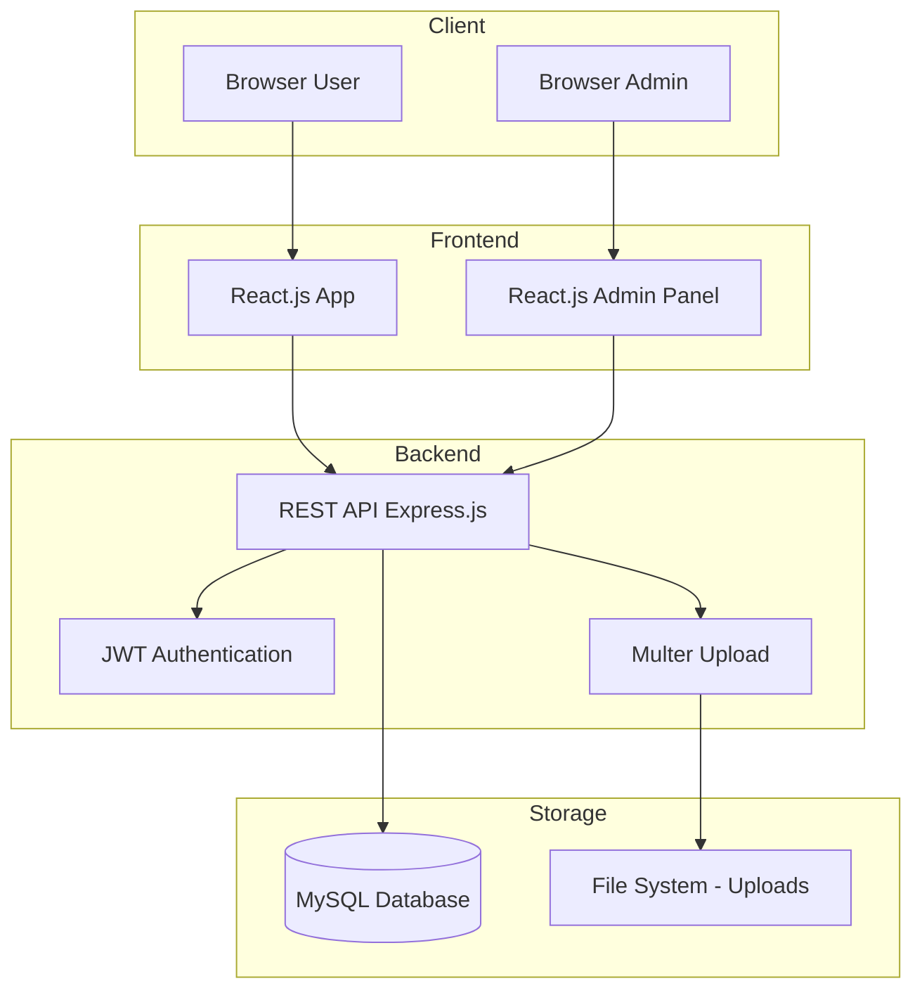
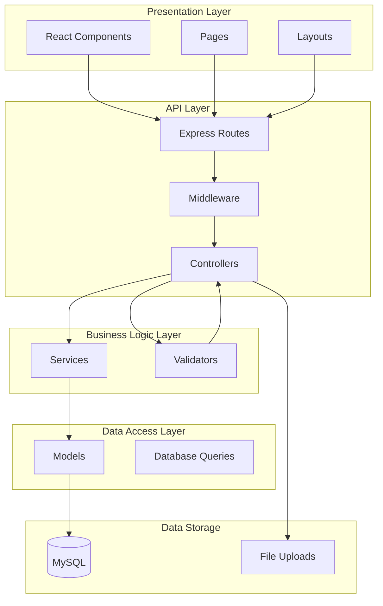
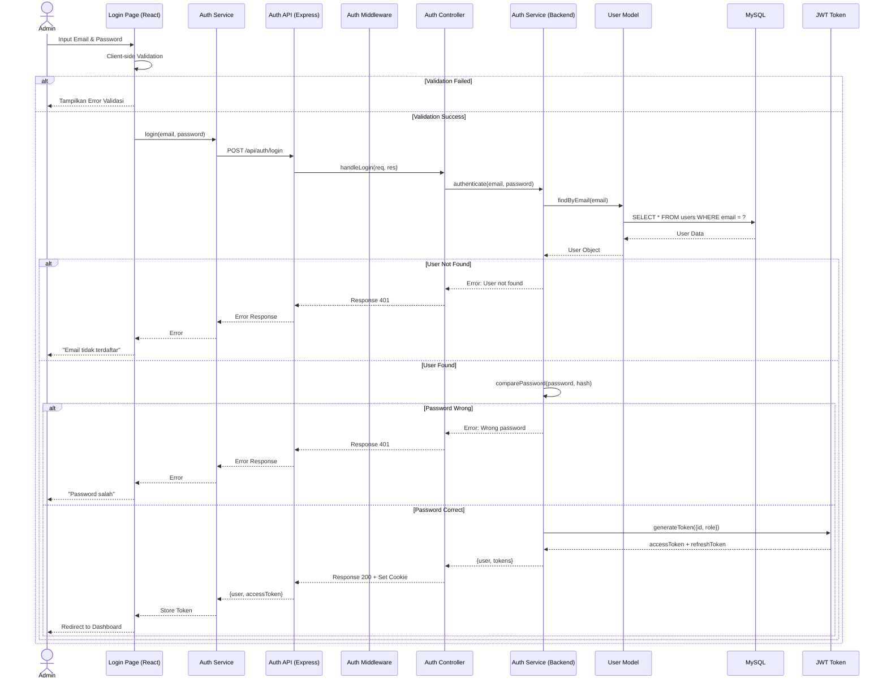
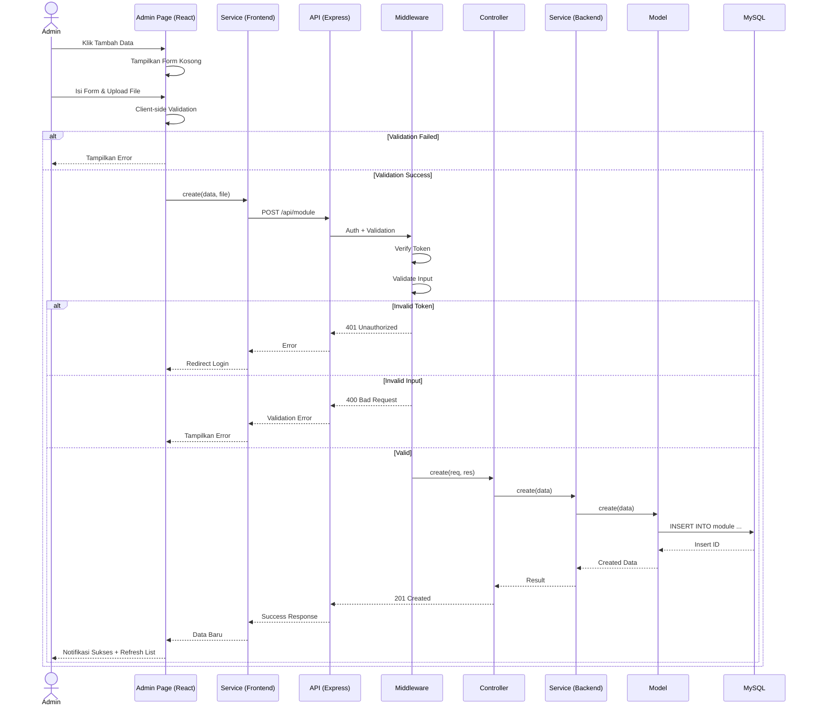
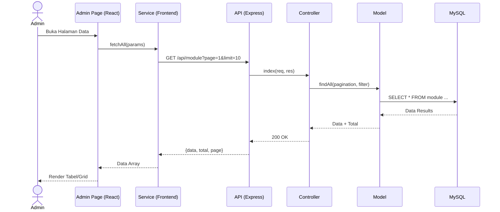
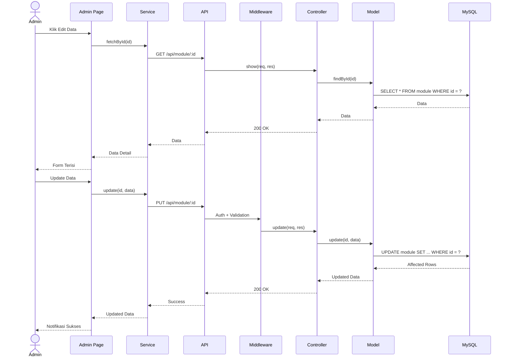
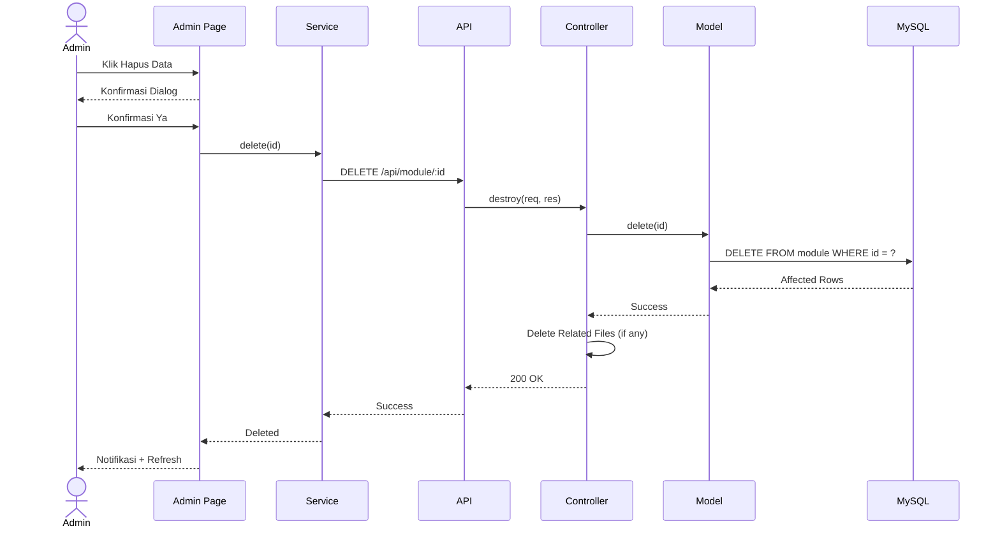
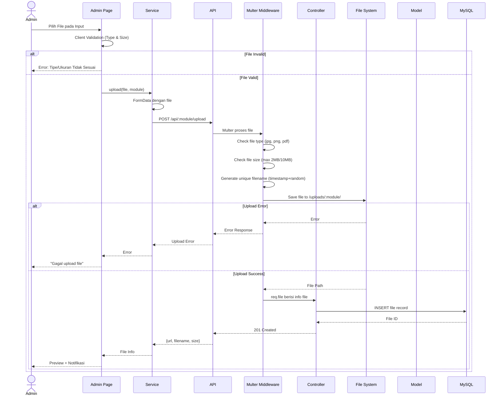
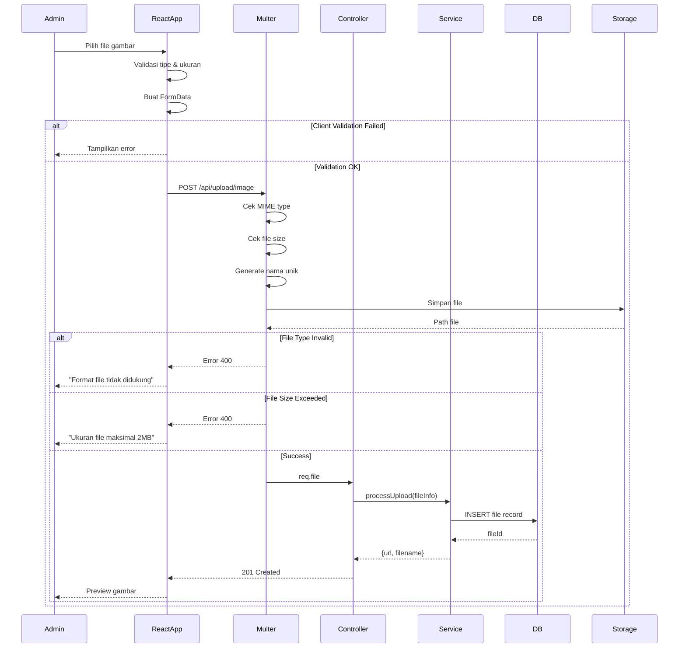
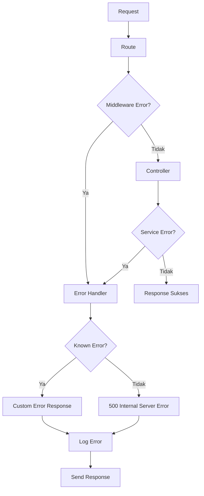

# System Design Document

## Website Profil Sekolah Dasar (SD)

---

**Dokumen**: SYSTEM_DESIGN - System Design Document
**Proyek**: Website Profil Sekolah Dasar
**Versi**: 1.0
**Tanggal**: 2025-01-01
**Status**: Draft

---

## Daftar Isi

1. [Arsitektur Sistem](#1-arsitektur-sistem)
2. [Folder Backend](#2-folder-backend)
3. [Folder Frontend](#3-folder-frontend)
4. [Flow Login](#4-flow-login)
5. [Flow CRUD](#5-flow-crud)
6. [Flow Upload](#6-flow-upload)
7. [API Architecture](#7-api-architecture)

---

## 1. Arsitektur Sistem

### 1.1 Arsitektur Umum



### 1.2 Arsitektur Berlapis (Layered Architecture)



### 1.3 Arsitektur Client-Server

```text
+---------------------+          +---------------------+
|                     |          |                     |
|   Browser Client    |  HTTP    |    Express Server   |
|   (React.js)        |<-------->|    (Node.js)        |
|                     |  JSON    |                     |
+---------------------+          +----------+----------+
                                            |
                                   +--------+--------+
                                   |                  |
                                   |   MySQL          |
                                   |   Database       |
                                   |                  |
                                   +------------------+
```

**Alur Request:**

1. Client (React) mengirim HTTP Request ke Server (Express)
2. Server menerima request melalui Route yang sesuai
3. Middleware memproses request (auth, validation, dll)
4. Controller menerima request yang sudah diproses
5. Controller memanggil Service untuk business logic
6. Service memanggil Model untuk operasi database
7. Model mengeksekusi query ke MySQL
8. Response dikembalikan melalui layer yang sama
9. Client menerima response JSON dan merender UI

---

## 2. Folder Backend

### 2.1 Struktur Folder Backend

```text
backend/
├── controllers/      # Menangani request dan response HTTP
├── routes/           # Mendefinisikan endpoint API
├── middlewares/       # Fungsi middleware (auth, upload, validation)
├── models/           # Model database (query ke MySQL)
├── services/         # Business logic aplikasi
├── config/           # Konfigurasi (database, env, dll)
├── uploads/          # Folder penyimpanan file upload
├── public/           # File statis (images, css, js)
├── utils/            # Fungsi utilitas (helpers)
├── logs/             # File log aplikasi
├── validators/       # Aturan validasi input
├── templates/        # Template email, laporan, dll
├── app.js            # Inisialisasi aplikasi Express
└── server.js         # Entry point server
```

### 2.2 Fungsi Masing-Masing Folder

#### controllers/

Berisi file controller yang menangani logika permintaan dan respons HTTP.

**Fungsi:**
- Menerima request dari routes
- Memanggil service untuk business logic
- Mengirim response JSON ke client
- Menangani error dan mengirimkan status code yang sesuai

**File contoh:**
- `authController.js`
- `newsController.js`
- `teacherController.js`
- `galleryController.js`
- `ppdbController.js`
- `settingController.js`

#### routes/

Berisi definisi route/endpoint API.

**Fungsi:**
- Mendefinisikan URL endpoint
- Menghubungkan HTTP method dengan controller
- Menerapkan middleware pada route tertentu
- Mengelompokkan route berdasarkan modul

**File contoh:**
- `authRoutes.js`
- `newsRoutes.js`
- `teacherRoutes.js`
- `galleryRoutes.js`
- `index.js` (router utama)

#### middlewares/

Berisi fungsi middleware Express.

**Fungsi:**
- `authMiddleware.js`: Verifikasi JWT token
- `uploadMiddleware.js`: Konfigurasi Multer untuk upload file
- `validationMiddleware.js`: Validasi input request
- `errorMiddleware.js`: Global error handler
- `cacheMiddleware.js`: Response caching
- `rateLimitMiddleware.js`: Rate limiting

#### models/

Berisi model untuk interaksi dengan database MySQL.

**Fungsi:**
- Mendefinisikan struktur tabel
- Menjalankan query SQL (SELECT, INSERT, UPDATE, DELETE)
- Mapping hasil query ke objek JavaScript

**File contoh:**
- `User.js`
- `News.js`
- `Teacher.js`
- `Gallery.js`
- `Setting.js`

#### services/

Berisi business logic aplikasi.

**Fungsi:**
- Memproses data sebelum disimpan ke database
- Menjalankan validasi bisnis
- Koordinasi antara multiple model
- Transformasi data untuk response

**File contoh:**
- `authService.js`
- `newsService.js`
- `uploadService.js`
- `emailService.js`

#### config/

Berisi konfigurasi aplikasi.

**Fungsi:**
- `database.js`: Konfigurasi koneksi MySQL
- `env.js`: Loading environment variables
- `app.js`: Konfigurasi aplikasi Express

#### uploads/

Folder untuk menyimpan file yang diupload.

**Sub folder:**
- `images/photos/`
- `images/thumbnails/`
- `documents/`
- `temporary/`

#### public/

Folder untuk file statis yang dapat diakses publik.

**Isi:**
- `images/`
- `favicon.ico`
- `robots.txt`

#### logs/

Folder untuk menyimpan file log.

**Isi:**
- `access.log`
- `error.log`
- `combined.log`

#### utils/

Berisi fungsi utilitas.

**Fungsi:**
- `response.js`: Standarisasi response API
- `slugify.js`: Generate URL slug
- `dateHelper.js`: Format tanggal
- `fileHelper.js`: Manipulasi file

---

## 3. Folder Frontend

### 3.1 Struktur Folder Frontend

```text
frontend/
├── public/             # File statis publik
├── src/
│   ├── components/     # Komponen reusable
│   │   ├── common/     # Komponen umum (Button, Card, dll)
│   │   ├── layout/     # Komponen layout (Header, Footer, Sidebar)
│   │   └── ui/         # UI components (Modal, Toast, dll)
│   ├── pages/          # Halaman aplikasi
│   │   ├── public/     # Halaman publik
│   │   └── admin/      # Halaman admin
│   ├── layouts/        # Layout template
│   ├── hooks/          # Custom React hooks
│   ├── services/       # API service calls
│   ├── context/        # React context
│   ├── assets/         # Asset statis (gambar, font)
│   ├── styles/         # File CSS
│   ├── utils/          # Fungsi utilitas
│   └── routes/         # Konfigurasi routing
├── package.json
└── README.md
```

### 3.2 Fungsi Masing-Masing Folder

#### components/

Komponen React yang reusable.

**common/:**
- `Button.jsx`
- `Card.jsx`
- `Input.jsx`
- `Modal.jsx`
- `Table.jsx`
- `Pagination.jsx`
- `Loading.jsx`
- `EmptyState.jsx`
- `ErrorState.jsx`

**layout/:**
- `PublicHeader.jsx`
- `PublicFooter.jsx`
- `PublicNavbar.jsx`
- `AdminSidebar.jsx`
- `AdminHeader.jsx`
- `AdminLayout.jsx`

**ui/:**
- `Toast.jsx`
- `Alert.jsx`
- `Breadcrumb.jsx`
- `Tabs.jsx`
- `Accordion.jsx`
- `Lightbox.jsx`
- `Slider.jsx`
- `CardGrid.jsx`

#### pages/

Halaman-halaman aplikasi.

**public/:**
- `HomePage.jsx`
- `ProfilePage.jsx`
- `TeachersPage.jsx`
- `AchievementsPage.jsx`
- `NewsPage.jsx`
- `NewsDetailPage.jsx`
- `GalleryPage.jsx`
- `GalleryDetailPage.jsx`
- `AgendaPage.jsx`
- `PPDBPage.jsx`
- `ContactPage.jsx`
- `FAQPage.jsx`
- `DownloadPage.jsx`

**admin/:**
- `DashboardPage.jsx`
- `LoginPage.jsx`
- `NewsManagementPage.jsx`
- `TeacherManagementPage.jsx`
- `GalleryManagementPage.jsx`
- `PPDBManagementPage.jsx`
- `SettingPage.jsx`

#### layouts/

Template layout yang digunakan di halaman.

**File:**
- `PublicLayout.jsx` - Layout untuk halaman publik
- `AdminLayout.jsx` - Layout untuk halaman admin
- `AuthLayout.jsx` - Layout untuk halaman login

#### hooks/

Custom React hooks.

**File:**
- `useAuth.js` - Hook untuk autentikasi
- `useFetch.js` - Hook untuk fetch data API
- `useForm.js` - Hook untuk manajemen form
- `usePagination.js` - Hook untuk pagination
- `useMediaQuery.js` - Hook untuk responsive

#### services/

Layanan untuk komunikasi dengan API backend.

**File:**
- `api.js` - Axios instance dengan konfigurasi dasar
- `authService.js`
- `newsService.js`
- `teacherService.js`
- `galleryService.js`
- `ppdbService.js`
- `uploadService.js`

#### context/

React Context untuk state global.

**File:**
- `AuthContext.jsx`
- `ThemeContext.jsx`
- `NotificationContext.jsx`

#### assets/

Asset statis.

**Folder:**
- `images/`
- `fonts/`
- `icons/`

#### styles/

File CSS.

**File:**
- `main.css` - CSS utama
- `variables.css` - CSS custom properties
- `reset.css` - CSS reset
- `utility.css` - Utility classes
- `responsive.css` - Media queries

#### utils/

Fungsi utilitas frontend.

**File:**
- `formatDate.js`
- `validation.js`
- `helpers.js`
- `constants.js`

#### routes/

Konfigurasi routing React Router.

**File:**
- `PublicRoutes.jsx`
- `AdminRoutes.jsx`
- `ProtectedRoute.jsx`

---

## 4. Flow Login

### 4.1 Diagram Flow Login



### 4.2 Alur Login (Text)

1. Admin membuka halaman `/admin/login`
2. Admin memasukkan email dan password
3. Client-side validation memeriksa format input
4. Jika valid, request dikirim ke `POST /api/auth/login`
5. Server menerima request dan memanggil `authController.login`
6. Controller memanggil `authService.authenticate(email, password)`
7. Service mencari user di database berdasarkan email
8. Jika user tidak ditemukan, return error 401
9. Jika user ditemukan, bandingkan password dengan bcrypt
10. Jika password salah, return error 401
11. Jika password benar, generate JWT token (access + refresh)
12. Token dikembalikan ke client
13. Client menyimpan token di localStorage/httpOnly cookie
14. Client redirect ke halaman dashboard

### 4.3 Middleware Auth

```text
Request Masuk
    ↓
Route Dilindungi?
    ├── Ya → Middleware Auth
    │        ↓
    │   Cek Header: Authorization Bearer <token>
    │        ↓
    │   Verifikasi Token JWT
    │        ↓
    │   Valid? → Lanjut ke Controller
    │   Tidak Valid? → Response 401 Unauthorized
    │
    └── Tidak → Langsung ke Controller
```

---

## 5. Flow CRUD

### 5.1 Diagram Flow CRUD (Create)



### 5.2 Diagram Flow CRUD (Read)



### 5.3 Diagram Flow CRUD (Update)



### 5.4 Diagram Flow CRUD (Delete)



---

## 6. Flow Upload

### 6.1 Diagram Flow Upload



### 6.2 Konfigurasi Multer

```javascript
// Konfigurasi penyimpanan
storage: diskStorage({
  destination: (req, file, cb) => {
    const path = `./uploads/${req.params.module}`;
    mkdirSync(path, { recursive: true });
    cb(null, path);
  },
  filename: (req, file, cb) => {
    const uniqueName = Date.now() + '-' + 
      Math.random().toString(36).substring(2, 8) + 
      path.extname(file.originalname);
    cb(null, uniqueName);
  }
})

// Filter file
fileFilter: (req, file, cb) => {
  const allowedImages = ['image/jpg', 'image/jpeg', 'image/png', 'image/webp'];
  const allowedDocs = ['application/pdf', 'application/msword'];
  
  if (allowedImages.includes(file.mimetype) || 
      allowedDocs.includes(file.mimetype)) {
    cb(null, true);
  } else {
    cb(new Error('Tipe file tidak didukung'), false);
  }
}

// Batas ukuran
limits: {
  fileSize: 2 * 1024 * 1024 // 2MB untuk gambar
}
```

---

## 7. API Architecture

### 7.1 Standar Response API

**Response Sukses:**

```json
{
  "success": true,
  "message": "Data berhasil diambil",
  "data": {},
  "meta": {
    "page": 1,
    "limit": 10,
    "total": 100,
    "totalPages": 10
  }
}
```

**Response Error:**

```json
{
  "success": false,
  "message": "Terjadi kesalahan",
  "errors": [
    {
      "field": "email",
      "message": "Email tidak valid"
    }
  ]
}
```

### 7.2 Daftar Endpoint API

#### 7.2.1 Authentication

| Method | Endpoint | Deskripsi | Auth |
|--------|----------|-----------|------|
| POST | /api/auth/login | Login admin | No |
| POST | /api/auth/logout | Logout admin | Yes |
| POST | /api/auth/refresh | Refresh token | Yes |
| GET | /api/auth/me | Profile admin saat ini | Yes |

#### 7.2.2 School Profile

| Method | Endpoint | Deskripsi | Auth |
|--------|----------|-----------|------|
| GET | /api/school-profile | Mendapatkan profil sekolah | No |
| PUT | /api/school-profile | Update profil sekolah | Yes |
| PUT | /api/school-profile/principal | Update sambutan kepala sekolah | Yes |
| PUT | /api/school-profile/history | Update sejarah sekolah | Yes |
| PUT | /api/school-profile/vision-mission | Update visi misi | Yes |
| PUT | /api/school-profile/organization-structure | Update struktur organisasi | Yes |

#### 7.2.3 Teachers

| Method | Endpoint | Deskripsi | Auth |
|--------|----------|-----------|------|
| GET | /api/teachers | Daftar guru | No |
| GET | /api/teachers/:id | Detail guru | No |
| POST | /api/teachers | Tambah guru | Yes |
| PUT | /api/teachers/:id | Update guru | Yes |
| DELETE | /api/teachers/:id | Hapus guru | Yes |

#### 7.2.4 Staffs

| Method | Endpoint | Deskripsi | Auth |
|--------|----------|-----------|------|
| GET | /api/staffs | Daftar staff | No |
| GET | /api/staffs/:id | Detail staff | No |
| POST | /api/staffs | Tambah staff | Yes |
| PUT | /api/staffs/:id | Update staff | Yes |
| DELETE | /api/staffs/:id | Hapus staff | Yes |

#### 7.2.5 News

| Method | Endpoint | Deskripsi | Auth |
|--------|----------|-----------|------|
| GET | /api/news | Daftar berita (publik) | No |
| GET | /api/news/:slug | Detail berita by slug | No |
| GET | /api/news/:id | Detail berita by id | Yes |
| POST | /api/news | Tambah berita | Yes |
| PUT | /api/news/:id | Update berita | Yes |
| DELETE | /api/news/:id | Hapus berita | Yes |
| PUT | /api/news/:id/publish | Ubah status publish | Yes |

#### 7.2.6 Categories

| Method | Endpoint | Deskripsi | Auth |
|--------|----------|-----------|------|
| GET | /api/categories | Daftar kategori | No |
| POST | /api/categories | Tambah kategori | Yes |
| PUT | /api/categories/:id | Update kategori | Yes |
| DELETE | /api/categories/:id | Hapus kategori | Yes |

#### 7.2.7 Announcements

| Method | Endpoint | Deskripsi | Auth |
|--------|----------|-----------|------|
| GET | /api/announcements | Daftar pengumuman | No |
| GET | /api/announcements/:id | Detail pengumuman | No |
| POST | /api/announcements | Tambah pengumuman | Yes |
| PUT | /api/announcements/:id | Update pengumuman | Yes |
| DELETE | /api/announcements/:id | Hapus pengumuman | Yes |

#### 7.2.8 Events

| Method | Endpoint | Deskripsi | Auth |
|--------|----------|-----------|------|
| GET | /api/events | Daftar agenda | No |
| GET | /api/events/:id | Detail agenda | No |
| POST | /api/events | Tambah agenda | Yes |
| PUT | /api/events/:id | Update agenda | Yes |
| DELETE | /api/events/:id | Hapus agenda | Yes |

#### 7.2.9 Achievements

| Method | Endpoint | Deskripsi | Auth |
|--------|----------|-----------|------|
| GET | /api/achievements | Daftar prestasi | No |
| GET | /api/achievements/:id | Detail prestasi | No |
| POST | /api/achievements | Tambah prestasi | Yes |
| PUT | /api/achievements/:id | Update prestasi | Yes |
| DELETE | /api/achievements/:id | Hapus prestasi | Yes |

#### 7.2.10 Galleries

| Method | Endpoint | Deskripsi | Auth |
|--------|----------|-----------|------|
| GET | /api/galleries | Daftar album galeri | No |
| GET | /api/galleries/:id | Detail album + foto | No |
| POST | /api/galleries | Tambah album | Yes |
| PUT | /api/galleries/:id | Update album | Yes |
| DELETE | /api/galleries/:id | Hapus album + foto | Yes |
| POST | /api/galleries/:id/images | Upload foto ke album | Yes |
| DELETE | /api/galleries/:id/images/:imageId | Hapus foto dari album | Yes |

#### 7.2.11 Videos

| Method | Endpoint | Deskripsi | Auth |
|--------|----------|-----------|------|
| GET | /api/videos | Daftar video | No |
| GET | /api/videos/:id | Detail video | No |
| POST | /api/videos | Tambah video | Yes |
| PUT | /api/videos/:id | Update video | Yes |
| DELETE | /api/videos/:id | Hapus video | Yes |

#### 7.2.12 Downloads

| Method | Endpoint | Deskripsi | Auth |
|--------|----------|-----------|------|
| GET | /api/downloads | Daftar download | No |
| GET | /api/downloads/:id | Detail download | No |
| POST | /api/downloads | Tambah download | Yes |
| PUT | /api/downloads/:id | Update download | Yes |
| DELETE | /api/downloads/:id | Hapus download | Yes |

#### 7.2.13 Sliders

| Method | Endpoint | Deskripsi | Auth |
|--------|----------|-----------|------|
| GET | /api/sliders | Daftar slider (active) | No |
| GET | /api/sliders/admin | Semua slider | Yes |
| POST | /api/sliders | Tambah slider | Yes |
| PUT | /api/sliders/:id | Update slider | Yes |
| DELETE | /api/sliders/:id | Hapus slider | Yes |
| PUT | /api/sliders/reorder | Urutkan slider | Yes |

#### 7.2.14 Banners

| Method | Endpoint | Deskripsi | Auth |
|--------|----------|-----------|------|
| GET | /api/banners | Daftar banner (active) | No |
| POST | /api/banners | Tambah banner | Yes |
| PUT | /api/banners/:id | Update banner | Yes |
| DELETE | /api/banners/:id | Hapus banner | Yes |

#### 7.2.15 Menus

| Method | Endpoint | Deskripsi | Auth |
|--------|----------|-----------|------|
| GET | /api/menus | Daftar menu navigasi | No |
| POST | /api/menus | Tambah menu | Yes |
| PUT | /api/menus/:id | Update menu | Yes |
| DELETE | /api/menus/:id | Hapus menu | Yes |
| PUT | /api/menus/reorder | Urutkan menu | Yes |

#### 7.2.16 Footer

| Method | Endpoint | Deskripsi | Auth |
|--------|----------|-----------|------|
| GET | /api/footer | Mendapatkan data footer | No |
| PUT | /api/footer | Update footer | Yes |

#### 7.2.17 PPDB

| Method | Endpoint | Deskripsi | Auth |
|--------|----------|-----------|------|
| GET | /api/ppdb/settings | Pengaturan PPDB | No |
| PUT | /api/ppdb/settings | Update pengaturan PPDB | Yes |
| POST | /api/ppdb/register | Pendaftaran PPDB | No |
| GET | /api/ppdb/registrants | Daftar pendaftar | Yes |
| GET | /api/ppdb/registrants/:id | Detail pendaftar | Yes |
| PUT | /api/ppdb/registrants/:id/status | Update status pendaftar | Yes |
| GET | /api/ppdb/check/:registrationNumber | Cek status pendaftaran | No |
| GET | /api/ppdb/export | Export data pendaftar | Yes |

#### 7.2.18 Testimonials

| Method | Endpoint | Deskripsi | Auth |
|--------|----------|-----------|------|
| GET | /api/testimonials | Daftar testimoni (active) | No |
| POST | /api/testimonials | Tambah testimoni | Yes |
| PUT | /api/testimonials/:id | Update testimoni | Yes |
| DELETE | /api/testimonials/:id | Hapus testimoni | Yes |

#### 7.2.19 FAQs

| Method | Endpoint | Deskripsi | Auth |
|--------|----------|-----------|------|
| GET | /api/faqs | Daftar FAQ | No |
| POST | /api/faqs | Tambah FAQ | Yes |
| PUT | /api/faqs/:id | Update FAQ | Yes |
| DELETE | /api/faqs/:id | Hapus FAQ | Yes |

#### 7.2.20 Contacts

| Method | Endpoint | Deskripsi | Auth |
|--------|----------|-----------|------|
| GET | /api/contacts | Mendapatkan data kontak | No |
| PUT | /api/contacts | Update data kontak | Yes |
| POST | /api/contacts/messages | Kirim pesan (publik) | No |
| GET | /api/contacts/messages | Daftar pesan masuk | Yes |
| GET | /api/contacts/messages/:id | Detail pesan | Yes |
| DELETE | /api/contacts/messages/:id | Hapus pesan | Yes |

#### 7.2.21 Social Media

| Method | Endpoint | Deskripsi | Auth |
|--------|----------|-----------|------|
| GET | /api/social-media | Daftar social media | No |
| POST | /api/social-media | Tambah social media | Yes |
| PUT | /api/social-media/:id | Update social media | Yes |
| DELETE | /api/social-media/:id | Hapus social media | Yes |

#### 7.2.22 Facilities

| Method | Endpoint | Deskripsi | Auth |
|--------|----------|-----------|------|
| GET | /api/facilities | Daftar fasilitas | No |
| POST | /api/facilities | Tambah fasilitas | Yes |
| PUT | /api/facilities/:id | Update fasilitas | Yes |
| DELETE | /api/facilities/:id | Hapus fasilitas | Yes |

#### 7.2.23 Programs

| Method | Endpoint | Deskripsi | Auth |
|--------|----------|-----------|------|
| GET | /api/programs | Daftar program | No |
| POST | /api/programs | Tambah program | Yes |
| PUT | /api/programs/:id | Update program | Yes |
| DELETE | /api/programs/:id | Hapus program | Yes |

#### 7.2.24 Users (Admin)

| Method | Endpoint | Deskripsi | Auth |
|--------|----------|-----------|------|
| GET | /api/users | Daftar user admin | Yes |
| GET | /api/users/:id | Detail user | Yes |
| POST | /api/users | Tambah user | Yes |
| PUT | /api/users/:id | Update user | Yes |
| DELETE | /api/users/:id | Hapus user | Yes |
| PUT | /api/users/:id/profile | Update profile sendiri | Yes |
| PUT | /api/users/:id/password | Ganti password | Yes |

#### 7.2.25 Settings

| Method | Endpoint | Deskripsi | Auth |
|--------|----------|-----------|------|
| GET | /api/settings | Mendapatkan pengaturan | No |
| PUT | /api/settings | Update pengaturan | Yes |
| GET | /api/settings/maintenance | Status maintenance | No |

#### 7.2.26 Upload

| Method | Endpoint | Deskripsi | Auth |
|--------|----------|-----------|------|
| POST | /api/upload/image | Upload gambar | Yes |
| POST | /api/upload/document | Upload dokumen | Yes |
| DELETE | /api/upload/:filename | Hapus file | Yes |

#### 7.2.27 Dashboard

| Method | Endpoint | Deskripsi | Auth |
|--------|----------|-----------|------|
| GET | /api/dashboard/stats | Statistik dashboard | Yes |
| GET | /api/dashboard/recent-activities | Aktivitas terbaru | Yes |
| GET | /api/dashboard/chart | Data chart | Yes |

#### 7.2.28 Logs

| Method | Endpoint | Deskripsi | Auth |
|--------|----------|-----------|------|
| GET | /api/logs | Daftar log aktivitas | Yes |
| GET | /api/logs/:id | Detail log | Yes |
| DELETE | /api/logs | Hapus log lama | Yes |

### 7.3 API Versioning

Semua endpoint menggunakan prefix `/api/` dan dapat ditambahkan versi jika diperlukan:

```text
/api/v1/news
/api/v1/teachers
```

### 7.4 HTTP Status Codes

| Kode | Deskripsi | Penggunaan |
|------|-----------|------------|
| 200 | OK | GET, PUT berhasil |
| 201 | Created | POST berhasil (data baru) |
| 204 | No Content | DELETE berhasil |
| 400 | Bad Request | Validasi gagal |
| 401 | Unauthorized | Token tidak valid/expired |
| 403 | Forbidden | Tidak punya akses |
| 404 | Not Found | Data tidak ditemukan |
| 409 | Conflict | Data duplikat |
| 422 | Unprocessable Entity | Validasi bisnis gagal |
| 429 | Too Many Requests | Rate limit exceeded |
| 500 | Internal Server Error | Server error |

---

## 8. Sequence Diagram Upload Gambar



---

## 9. Error Handling Flow



---

## 10. Dokumen Terkait

- [Product Requirement Document](./PRD.md)
- [Database Design](./DATABASE.md)
- [UI/UX Guidelines](./UI_UX.md)
- [Project Structure](./PROJECT_STRUCTURE.md)
- [Roadmap](./ROADMAP.md)

---
